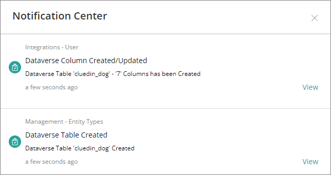

This feature will allow you to Synchronize the CluedIn Entity Types, Vocabs, and Vocabulary Keys into the Dataverse table and column.

- In the textbox above, you need to specify and provide which EntityTypes to sync. For multiple values, it should be separated by a comma _(/_Type1,/Type2,..)_ 
- All the Vocabulary keys below will be created as columns in Dataverse

- Once the Synchronization is successfully executed, there 2 notifications to be expected. Creation of the table and Create/Update of the Columns.

- Verifying the table and columns created in Dataverse
