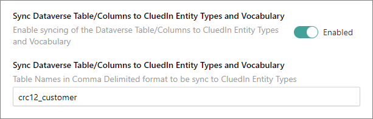
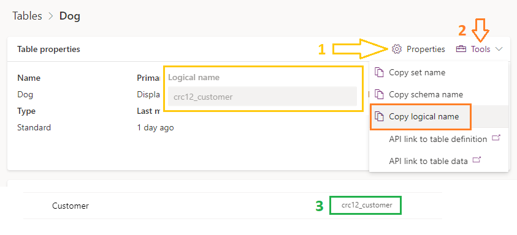
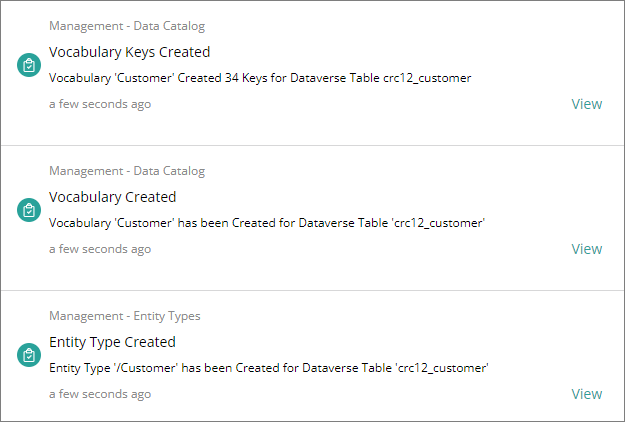
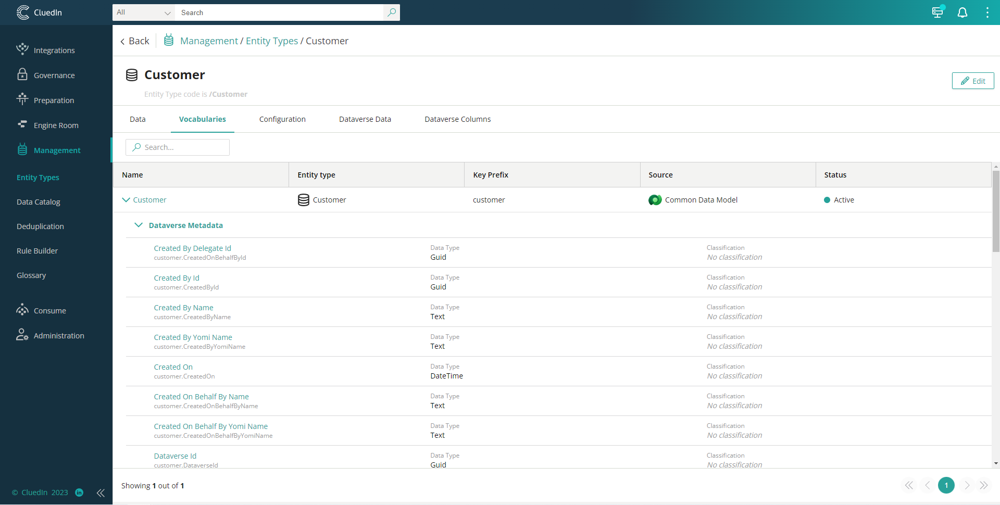

This feature will allow you to Synchronize the Dataverse Table and columns into CluedIn Entity Type, Vocabulary, and Vocabulary Keys

In the textbox above, you need to specify and provide which Dataverse table to sync. The value should be the **logical name** of the table. For multiple values, it should be separated by a comma _(logical_name1_,logical_name2,..)_
- There are ways to identify or get the logical name of the table
  1. Go to table Properties => look for the logical name value
  2. Tools => Copy the logical name
  3. In the Table List view, the logical name is right after the table name

- Once the synchronization has been successfully executed, three success notifications will be displayed to the user. Creation of the Entity Type, Creation of Vocabulary, and Creation of Vocabulary Keys.

- Verifying Entity Type, Vocabulary, and Vocabulary Keys created.
