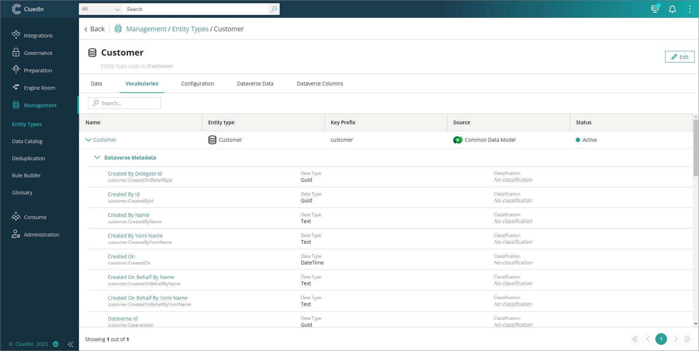

This feature allows you to sync Dataverse table and columns into CluedIn entity type, vocabulary, and vocabulary keys.

**Prerequisites**

You'll need to provide the logical name of the Dataverse table. There are the following ways to identify or get the logical name of the table:

1. Go to table **Properties**, and then copy the value from the **Logical name** field.

1. Go to **Tools**, and then select **Copy logical name**.

1. In the table list view, the logical name is right after the table name.

    

**To sync Dataverse table and columns into CluedIn entity types and vocabulary**

1. On the navigation pane, go to **Administration** > **Settings**, and then find the **PowerApps** section.

1. In **Sync Dataverse Table/Columns to CluedIn Entity Types and Vocabulary**, turn on the toggle, and then enter the Dataverse table name. The value should be the **logical name** of the table. If you want to sync multiple tables, separate them with a comma (for example, _logical_name1_,logical_name2,logical_name3_).

    

    Once the synchronization has been successfully completed, you'll receive three notifications: **Entity Type Created**, **Vocabulary Created**, and **Vocabulary Keys Created**.
    
    

1. Verify the entity type, vocabulary, and vocabulary keys created in CluedIn.

    