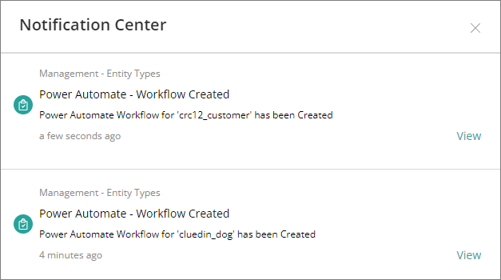
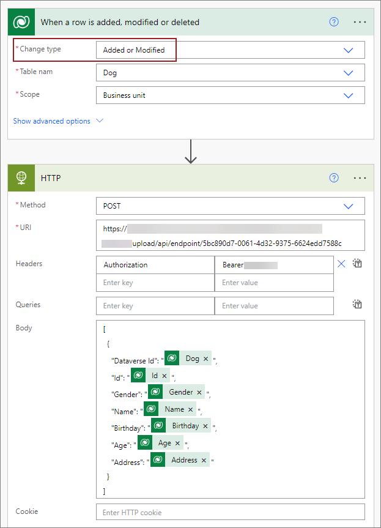
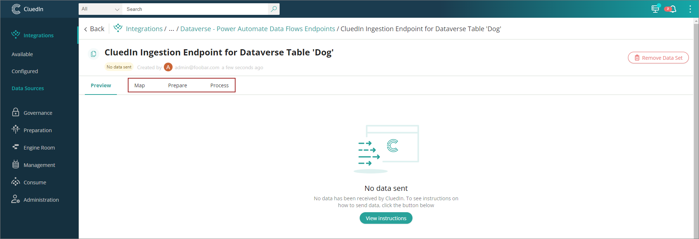
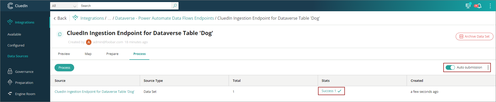

This feature allows you to automate the creation of workflow that will send the data from Dataverse to CluedIn via ingestion endpoint.

**Prerequisites**

- Dataverse connection. For more information, refer to this [link](/microsoft-integration/powerapps/setup-credentials).

**To automate the workflow creation**

1. In CluedIn, on the navigation pane, go to **Administration** > **Settings**, and then find the **PowerApps** section.

1. In **Create workflow to Ingest Data to CluedIn**, turn on the toggle.

    

**Ingestion endpoint**

As part of workflow automation, the ingestion endpoint will be created as well. From our sample above, you can expect two ingestion endpoints to be created, one for each of the **cluedin_dog** and **crc12_customer** tables.
    

**Workflow**

The creation of workflow will depend on the values of **Sync Business Domains** and **Sync Dataverse Tables**. Once the execution of the job is done, from the sample values above, you can expect two workflows to be created, one for each of the **cluedin_dog** and **crc12_customer** tables.

You can expect to see a notification when the creation is successful.

The content of the workflow will be composed of a Dataverse event named _When a row is added, modified or delete_ (but mainly focused on _Added and Modified_) and an HTTP event that pushes the data into CluedIn ingestion endpoint. On the following screenshot, the token has been edited to show the full content of HTTP event.

**Auto mapping and procesing**
    
As we already know the structure of the table/vocabulary that we are working on, the system will automate the data mapping and processing. By navigating to the data set page, you can notice that the **Map**, **Prepare**, and **Process** tabs are now available as we already automated the creation of the data mapping into our vocabularies.

On the **Map** tab, you can find the the full view of all columns mapped to our vocabulary, including edges (relationships) and identifiers, if there are any.

On the **Preview** tab, you can find the data received from Dataverse.

Once the data is received, you can expect to see it processed because we have also enabled the **Auto submission** property of the ingestion endpoint.

