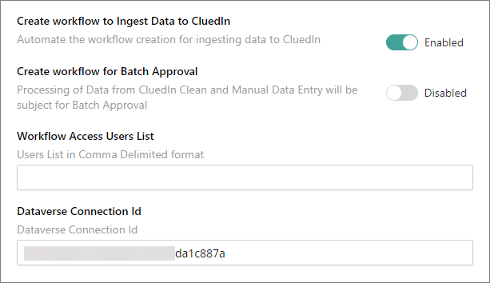
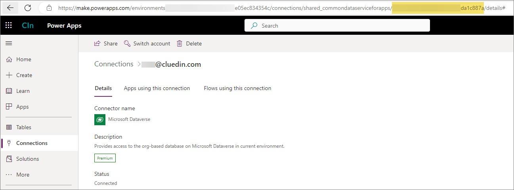
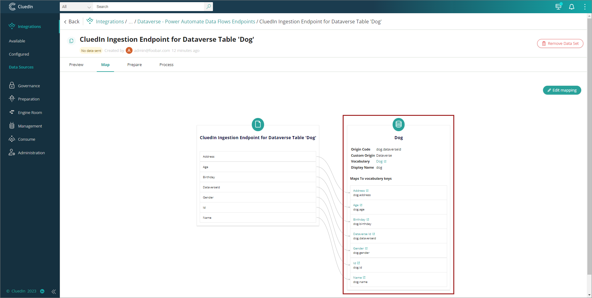

This feature will allow you to automate the creation of Power Automate Workflow that will send the data from Dataverse to CluedIn via Ingestion Endpoint.

## Dataverse Connection Id
- In the textbox above, you need to provide the Dataverse Connection Id. This Connection Id will allow you to access the PowerApps Table in the Power Automate workflow.
- To generate, navigate to PowerApps => Connection Page on the left navigation panel.
- Click on the _New Connection_ button. Search and select Microsoft Dataverse

- The Connection Id value can be found in the URL when you open the Dataverse connection you've created.

## Ingestion Endpoint
- As part of workflow automation, Ingestion Endpoint will be created as well. From our sample above, you can expect two Ingestion Endpoints to be created, one for each of the '**cluedin_dog**' and '**crc12_customer**' tables.

## Workflows
- The creation of workflow will depend on the values of Sync EntityTypes and Sync Dataverse Tables values.
- Once the execution of the Job is done, from the sample values above, you can expect two workflows to be created, one for each of the '**cluedin_dog**' and '**crc12_customer**' tables.

- Notification can be expected to show once the creation is successful.

- The content of the workflow will compose of an event in Dataverse '_When a row is added, modified or delete_' (but mainly focus on Added and Modified only) and an HTTP event that pushes the data into CluedIn Ingestion Endpoint.

## Auto Mapping and Processing
- As we already know the structure of the table/vocab that we are working on, the system will automate the data mapping and processing.
- By navigating to the Dataset Page, you can notice that the Map, Prepare and Process Tab is now available as we already automated the creation of the Data Mapping into our Vocabs.

- Looking into _Map_ Tab will give you the full view of all columns mapped to our Vocabulary. Including Edges (Relationships) and Origin Entity Code (Keys), if there are any.

- Once the data has been received, you can expect to see that as processed data in CluedIn, as we also enabled the Auto Submission property of the Ingestion Endpoint.
