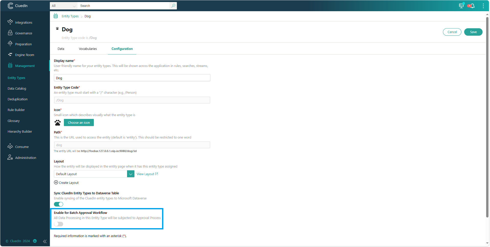
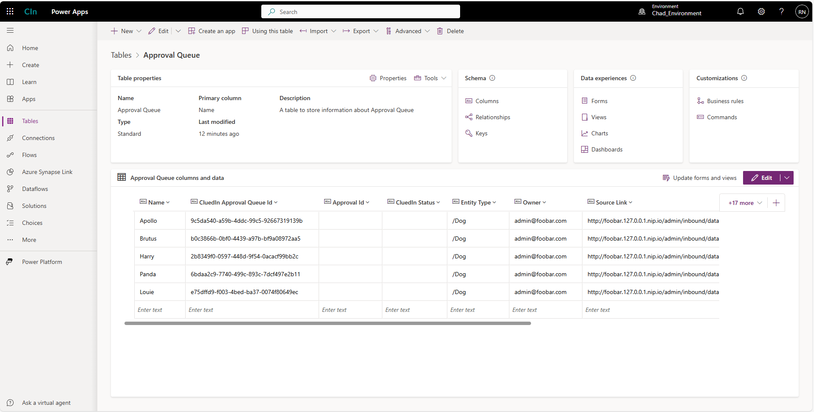
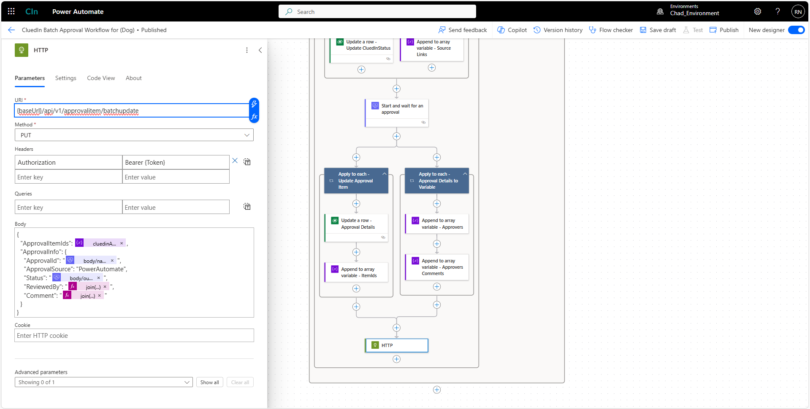
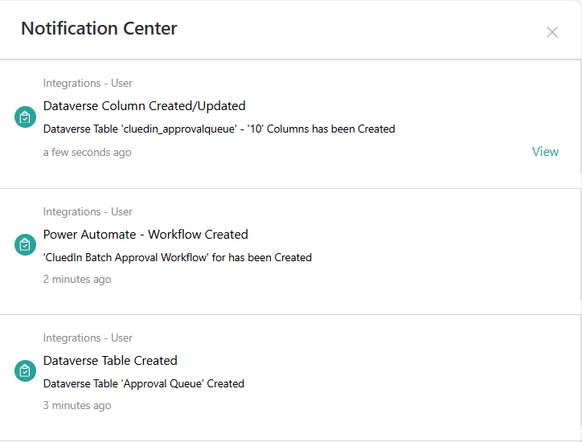

This feature enables you to automate the creation of the workflow for the batch approval process. If you process the data (regardless of the source) and the system identifies that the business domain used has been tagged for the approval process, the data will be halted, and the approval process will start and wait for the user's approval to continue the data processing.

**Prerequisites**

- Dataverse connection
- Approval connection

For more information, refer to this [link](/microsoft-integration/powerapps/setup-credentials).

**To enable the batch approval workflow**

1. In CluedIn, on the navigation pane, go to **Management** > **Business Domains**, and then select the business domain that you want to sync.

1. Select **Edit** and then turn on the toggle for **Enable for Batch Approval Workflow**.

1. Select **Save**.
    
    

    After enabling this feature, a new table (Approval Queue Table) will be created in Dataverse.

**Approval Queue table in Dataverse**

This table will serve as a storage of the CluedIn data or information on the data waiting for approval.

The **CluedIn Approval Queue ID** is the ID of the data that we are trying to approve in this process.

**Workflow**

The content of the approval workflow will be composed of events such as condition, approval, variables, and HTTP. A 60-second cycle will occur to check if there is data in the **Approval Queue** table. Once we receive a response in the Approval Process, we send the Approval details together with the CluedIn Approval Queue IDs to the CluedIn API via an HTTP event.

**Notifications**

Once the automation has been done, you can expect a notification for creating the Approval Queue Table/Columns and the creation of the Batch Approval Workflow.

