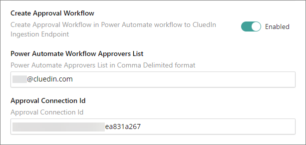
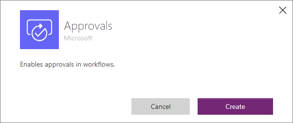

An additional option in creating the workflow is the Approval process. This will enable you to approve a certain action before sending the data to the Ingestion Endpoint.

## Approval Connection Id
- In the textbox above, you need to provide the Approval Connection Id. This Connection Id will allow you to access to create an approval workflow.
- To generate, navigate to PowerApps => Connection Page on the left navigation panel.
- Click on the _New Connection_ button. Search and select Approvals

- The Connection Id value can be found in the URL when you open the approval connection you've created.

## Approval Connection Content
- The content of the Approval workflow will compose of Approval Event, Condition, and Yes/No event block.
- The data will be sent to the HTTP event that is under the Yes Event block if the output of the Approval Event is _Approve_, otherwise, it will do nothing.
