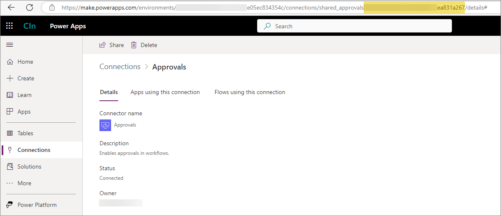
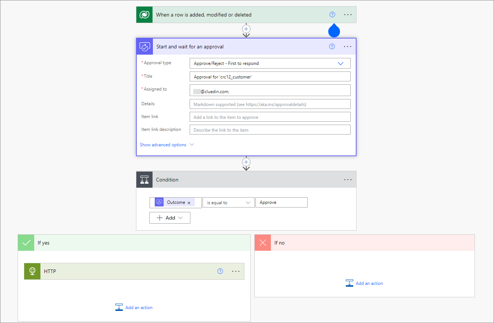

This feature enables you to approve a specific action before sending the data to the ingestion endpoint. This is an additional feature to the [workflow creation](/microsoft-integration/powerapps/features/create-workflow) process.

**Prerequisites**

You'll need to provide the Approval connection ID. To generate the the Approval connection ID:

1. In Power Apps, on the left navigation pane, select **Connections**.

1. Select **New connection**.

1. In the list that appears, find and select **Approvals**.

1. Select **Create**.

    

1. Open the Approvals connection that you've just created, and then copy the connection ID in the URL field.

    

**To create the workflow approval process**

1. In CluedIn, on the navigation pane, go to **Administration** > **Settings**, and then find the **PowerApps** section.

1. In **Create Approval Workflow**, turn on the toggle.

1. In **Approval Connection Id**, enter the Approval connection ID. This connection ID will allow you to create the approval workflow.

    

**Workflow**

The content of the approval workflow will be composed of approval event, condition, and Yes/No event block. The data will be sent to the HTTP event that is under the Yes event block if the output of the approval event is _Approve_. Otherwise, it will do nothing.

