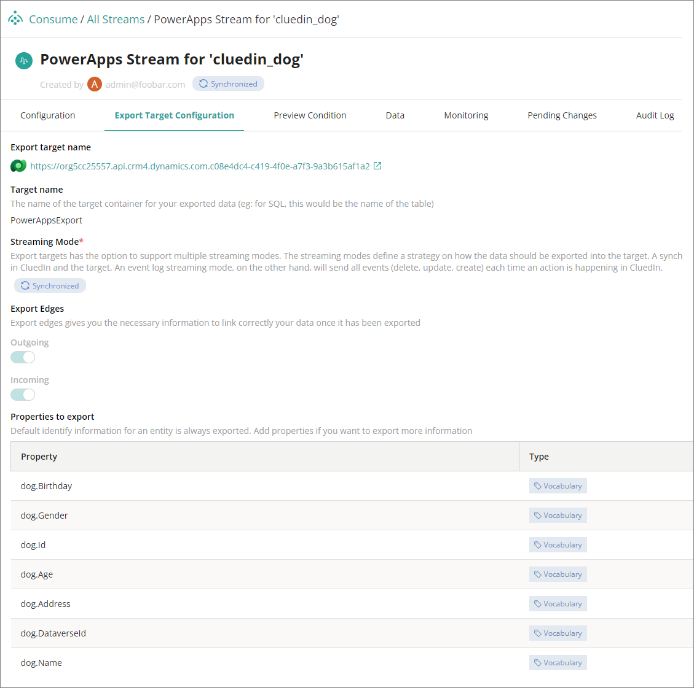

This feature allows you to automate the creation of export targets and streams.

**To automate the creation of export targets and streams**

1. On the navigation pane, go to **Administration** > **Settings**, and then find the **PowerApps** section.

1. In **Create CluedIn Stream**, turn on the toggle.

    

**Export targets**

Export target will be created automatically using the same credentials from Organization Settings.

**Streams**

The creation of a stream will depend on the values of **Sync Entity Types** and **Sync Dataverse Tables**.

Once the execution of the job is done, from the sample values above, two streams should have been created, one for each of the **cluedin_dog** and **crc12_customer** tables.

Each stream will have a certain configuration filtered by entity type.

It will automatically assign the same export target that was created from the Dataverse connector. Incoming and outgoing edges are set to be exported. All the properties associated with it have been automatically added too.

**Notifications**

Two notifications can be expected in this job: **Stream created** and **Stream mapping updated**.

