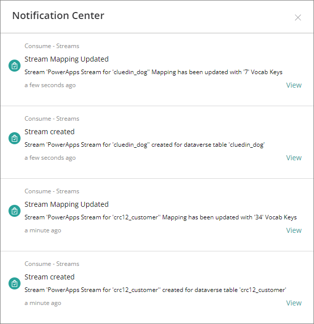

This feature will allow you to automate the creation of Export Targets and Streams

#### Export Targets
- Export Target will be created automatically using the same credentials from Organization Settings

#### Streams
- The creation of a stream will depend on the values of Sync EntityTypes and Sync Dataverse Tables values.
- Once the execution of the Job is done, from the sample values above, you can expect 2 streams to be created, which is for the '**cluedin_dog**' and '**crc12_customer**' table.

- Each stream will have a certain configuration filtered by EntityType

- It will automatically assign the same export target that was created from the Dataverse connector. Incoming and Outgoing Edges are set to be exported. All the properties associated with it have been automatically added too.

#### Notifications
- 2 notifications can be expected in this job
  1. Stream Creation
  2. Updating the property mappings
- 