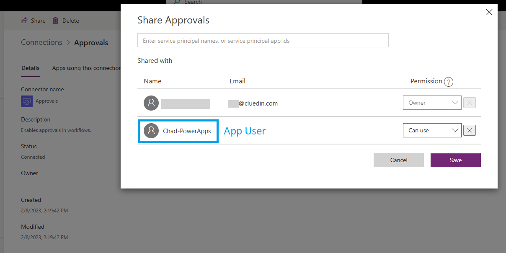
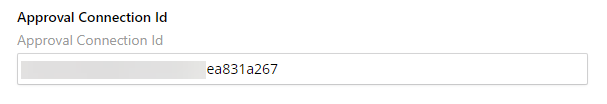
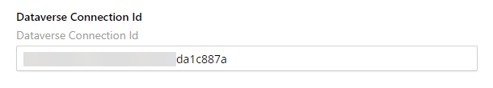

## On this page
{: .no_toc .text-delta }
1. TOC
{:toc}

To be able to automate the workflow creation, you need to manually create some connections and share them with the Application User.

## Create a connection

You need to create two connections: Approvals and Dataverse.

**To create a connection**

1. In Power Apps, on the left navigation pane, select **Connections**.

1. Select **New connection**.

1. In the list that appears, find and select a connection that you want to create. In this example, we are selecting **Approvals**.

1. Select **Create**.

    

1. Create the Dataverse connection following steps 1–4.

    

## Get the connection ID

Open the Approvals connection that you've just created, and then copy the connection ID in the URL field.

## Share connection with the application user

1. On the top of the page, select **Share**.

1. Find and select the application user. Then, grant the **Can use** or **Can edit** permission.

 1. Select **Save**.

    

## Add connection ID to organization settings

1. In CluedIn, on the navigation pane, go to **Administration** > **Settings**, and then find the **PowerApps** section.

1. In **Approval Connection Id**, enter the Approval connection ID. This connection ID will allow you to create the approval workflow.

    

1. In **Dataverse Connection Id**, enter the Dataverse connection ID. This connection ID will allow you to access the Power Apps table in the Power Automate workflow.

    

