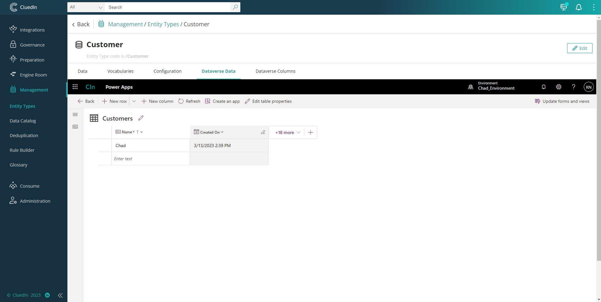
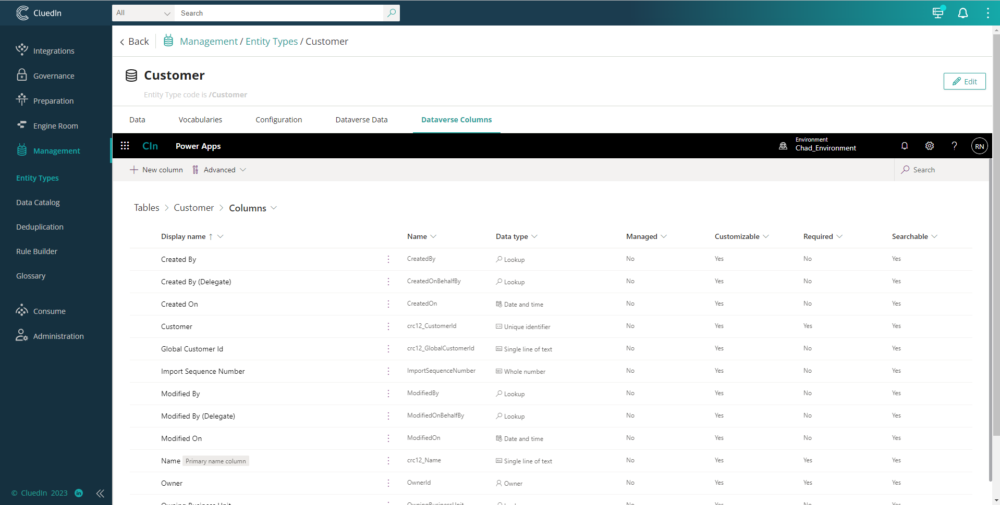
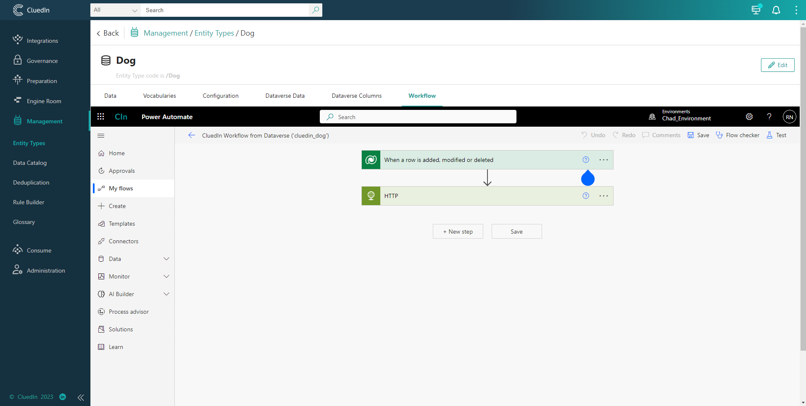

This will enable the user to see the PowerApps and Power Automate features as an iFrame in CluedIn UI. The feature below will only appear on Entity Types main page if that Entity Type is part of the synchronization.

### Dataverse Data
This will enable you to see and navigate to PowerApps table data. Able to add, edit and delete data directly from a PowerApps platform.

### Dataverse Columns
This will enable you to see and navigate to PowerApps Columns. Able to Add, edit and delete columns directly from a PowerApps platform

### Workflow
This will enable you to see the Workflow associated with it. View the columns that have been synced and the ingestion endpoint details in the HTTP Event.
