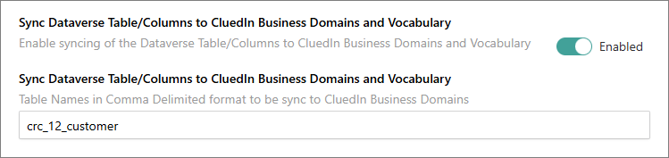

## On this page
{: .no_toc .text-delta }
- TOC
{:toc}

## Sync business domains to Dataverse tables

This feature allows you to sync CluedIn business domains, vocabularies, and vocabulary keys with Dataverse table and columns.

There are several ways how you can perform the sync:

- From CluedIn settings – This option is convenient if you want to sync multiple business domains at once.

- From the **Business Domains** module – This option is convenient if you want to sync one business domain at a time.

**To sync CluedIn business domains with Dataverse table (from CluedIn settings)**

1. On the navigation pane, go to **Administration** > **Settings**, and then find the **PowerApps** section.

1. In **Sync CluedIn Business Domains to Dataverse Table**, turn on the toggle, and then enter the business domain that you want to sync. If you want to sync multiple business domains, separate them with a comma (for example, _/_Type1,/Type2,/Type3_).

    

    All the vocabulary keys below will be created as columns in the Dataverse table.

    

    Once the synchronization has been completed, you'll receive two notifications: **Dataverse Table Created** and **Dataverse Column Created/Updated**.

    

1. Verify the table and columns created in Dataverse.

    

**To sync CluedIn business domains with Dataverse table (from the Business Domains module)**

1. On the navigation pane, go to **Management** > **Business Domains**.

1. Select the business domain that you want to sync.

1. In the upper-right corner of the business domain page, select **Edit**.

1. On the **Configuration** tab, do the following:

    1. Turn on the **Sync CluedIn Business Domain to Dataverse Table** toggle.
    
    1. In **Vocabulary for Dataverse Sync**, enter the names of vocabularies to include in the Dataverse sync. If you enter multiple names, they must be provided as a comma-separated list. To sync all vocabularies associated with this business domain, leave this field empty.

    
    
1. In the upper-right corner of the business domain page, select **Save**.

    All the vocabulary keys below will be created as columns in the Dataverse table.

    

    Once the synchronization has been completed, you'll receive two notifications: **Dataverse Table Created** and **Dataverse Column Created/Updated**.

    

1. Verify the table and columns created in Dataverse.

    

## Sync Dataverse table to Cluedin business domains/vocabularies

This feature allows you to sync Dataverse table and columns into CluedIn business domains, vocabulary, and vocabulary keys.

**Prerequisites**

You'll need to provide the logical name of the Dataverse table. There are the following ways to identify or get the logical name of the table:

1. Go to table **Properties**, and then copy the value from the **Logical name** field.

1. Go to **Tools**, and then select **Copy logical name**.

1. In the table list view, the logical name is right after the table name.

    

**To sync Dataverse table and columns into CluedIn business domains and vocabulary**

1. On the navigation pane, go to **Administration** > **Settings**, and then find the **PowerApps** section.

1. In **Sync Dataverse Table/Columns to CluedIn Business Domains and Vocabulary**, turn on the toggle, and then enter the Dataverse table name. The value should be the **logical name** of the table. If you want to sync multiple tables, separate them with a comma (for example, _logical_name1_,logical_name2,logical_name3_).

    

    Once the synchronization has been successfully completed, you'll receive three notifications: **Entity Type Created**, **Vocabulary Created**, and **Vocabulary Keys Created**.
    
    

1. Verify the business domain, vocabulary, and vocabulary keys created in CluedIn.

    

## Create ingestion endpoint workflow

This feature allows you to automate the creation of workflow that will send the data from Dataverse to CluedIn via ingestion endpoint.

**Prerequisites**

- Dataverse connection.

**To automate the workflow creation**

1. In CluedIn, on the navigation pane, go to **Administration** > **Settings**, and then find the **PowerApps** section.

1. In **Create workflow to Ingest Data to CluedIn**, turn on the toggle.

    

1. (Optional) In **Workflow Access Users List**, enter one or more email addresses in a comma-delimited format to grant access to the created workflow. All addresses must be registered in your Azure organization directory.

    

**Ingestion endpoint**

As part of workflow automation, the ingestion endpoint will be created as well. From our sample above, you can expect two ingestion endpoints to be created, one for each of the **cluedin_dog** and **crc12_customer** tables.
    

**Workflow**

The creation of workflow will depend on the values of **Sync Business Domains** and **Sync Dataverse Tables**. Once the execution of the job is done, from the sample values above, you can expect two workflows to be created, one for each of the **cluedin_dog** and **crc12_customer** tables.

You can expect to see a notification when the creation is successful.

The content of the workflow will be composed of a Dataverse event named _When a row is added, modified or delete_ (but mainly focused on _Added and Modified_) and an HTTP event that pushes the data into CluedIn ingestion endpoint. On the following screenshot, the token has been edited to show the full content of HTTP event.

**Auto mapping and processing**
    
As we already know the structure of the table/vocabulary that we are working on, the system will automate the data mapping and processing. By navigating to the data set page, you can notice that the **Map**, **Prepare**, and **Process** tabs are now available as we already automated the creation of the data mapping into our vocabularies.

On the **Map** tab, you can find the the full view of all columns mapped to our vocabulary, including edges (relationships) and identifiers, if there are any.

On the **Preview** tab, you can find the data received from Dataverse.

Once the data is received, you can expect to see it processed because we have also enabled the **Auto submission** property of the ingestion endpoint.

## Create streams

This feature allows you to automate the creation of export targets and streams.

**Prerequisites**

- CluedIn.Connector.Dataverse is installed.

**To automate the creation of export targets and streams**

1. On the navigation pane, go to **Administration** > **Settings**, and then find the **PowerApps** section.

1. In **Create CluedIn Stream**, turn on the toggle.

    

**Export targets**

Export target will be created automatically using the same credentials from Organization Settings.

**Streams**

The creation of a stream will depend on the values of **Sync Business Domains** and **Sync Dataverse Tables**.

Once the execution of the job is done, from the sample values above, two streams should have been created, one for each of the **cluedin_dog** and **crc12_customer** tables.

Each stream will have a certain configuration filtered by business domain.

It will automatically assign the same export target that was created from the Dataverse connector. Incoming and outgoing edges are set to be exported. All the properties associated with it have been automatically added too.

**Notifications**

Two notifications can be expected in this job: **Stream created** and **Stream mapping updated**.

