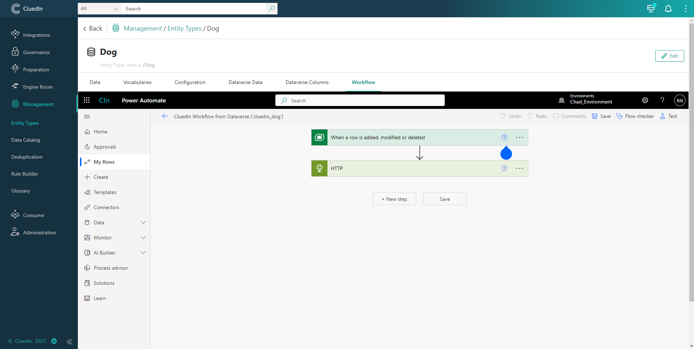

## On this page
{: .no_toc .text-delta }
1. TOC
{:toc}

This will enable the user to see the Power Apps and Power Automate features as an iFrame in CluedIn UI. The feature below will only appear on the business domain's main page if that business domain is part of the synchronization.

### Dataverse data

This will enable you to see and navigate to Power Apps table data as well as add, edit, and delete data directly from a Power Apps platform.

### Dataverse columns

This will enable you to see and navigate to PowerApps columns as well as add, edit, and delete columns directly from a Power Apps platform.

### Workflow

This will enable you to see the workflow associated with it as well as wiew the columns that have been synced and the ingestion endpoint details in the HTTP event.

