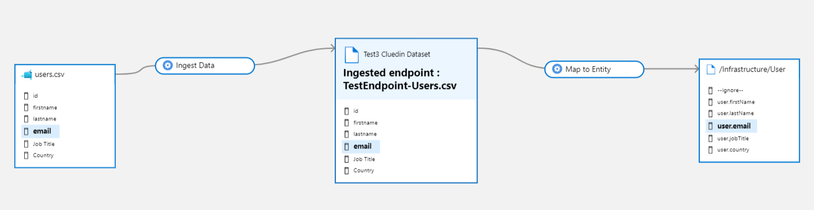
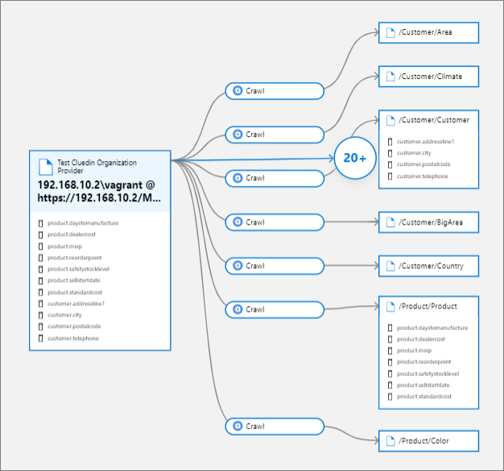
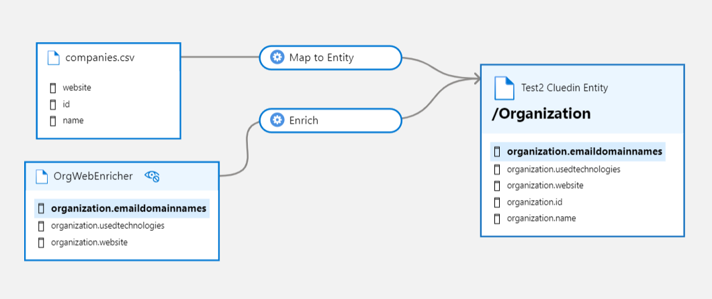
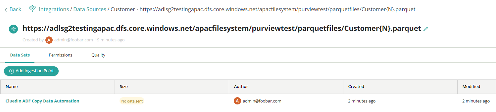

## On this page
{: .no_toc .text-delta }
- TOC
{:toc}

This article describes the Microsoft Purview integration features.

## Sync CluedIn Data Sources

When this feature is enabled, CluedIn fetches all Microsoft Purview asset entities from Purview to create data source groups and their respective data sources. The data source groups can be viewed in **Integrations** > **Data Sources**. The CluedIn Purview integration components create Purview assets under a single root collection.

CluedIn creates a lineage when one or more data sets are created within a data source associated with a Purview asset entity previously created via the **Sync CluedIn Data Sources** feature. The **Ingest Data** process displays data flow from the Microsoft Purview asset entity to a newly created or updated Microsoft Purview data set entity. The Microsoft Purview data set entity represents the CluedIn data set with its populated column names.

Data sets in CluedIn with a mapping of at least one property to a CluedIn entity type results in both the CluedIn entity and the **Map to Entity** process being created in Purview. The **Map to Entity** process connects the CluedIn data set to the CluedIn entity type under the assets lineage tab.

The following image shows an example of a data set lineage.

Background processes in CluedIn detect changes in CluedIn data sets and their respective mapping. These changes are synchronized with the existing Microsoft Purview data set assets.

## Auto-Map CluedIn Data Sets

This feature auto-maps data sets to a vocabulary matching the Purview asset's glossary term. The feature applies to data sets tied to Purview asset and has Purview glossary terms assigned to either the Purview asset itself or the schema columns.

The Purview glossary terms used by the Purview assets must first be added as CluedIn vocabularies. If the vocabulary (made from Purview glossary terms) is available, the data set is automatically mapped to the right vocabulary.

Sync interval applies to this feature.

## Poll CluedIn Data Sources

This feature differs from **Sync CluedIn Data Sources** by updating the existing data set entities on Microsoft Purview lineages without having to sync new data sources on Microsoft Purview back to CluedIn. Data quality metrics for the associated data sources in CluedIn are also synced back to Microsoft Purview lineages this way.

## Sync CluedIn Streams

A background processing in CluedIn synchronizes streams and their respective export connector as assets in Purview. These assets show outbound lineage from CluedIn entity types to the export target.

## Monitor Events

CluedIn updates Microsoft Purview entities when specific actions are carried out by a user in CluedIn. The supported actions are as follows:

- Adding or removing a CluedIn data source or enrichers.

- Adding, updating, reprocessing or removing a CluedIn stream.

- Adding, updating or removing a CluedIn export target.

## Sync Purview glossaries to CluedIn vocabularies

This synchronization feature allows the import of Microsoft Purview glossaries as CluedIn vocabularies. If there are matching CluedIn vocabularies, they will be updated; otherwise, new CluedIn vocabularies are created for the incoming Microsoft Purview glossaries.

## Sync CluedIn Vocabularies to Purview Glossary Terms

![Purview glossary terms created under the root glossary term "CluedIn" + [Your machine name], ex. "CluedIn-Dell"](./media/vocab_to_glossary.png)

Purview glossary terms are created under the root glossary term "CluedIn" + [Your machine name] (e,g. "CluedIn-Dell").

By default, a CluedIn root glossary term is created in Purview glossaries. New glossary terms are created under the root glossary term.

If a glossary term is deleted but the vocabulary or vocabulary key still exists, the sync re-creates the glossary term. If a vocabulary or vocabulary key is deleted, the linked glossary term is removed, except for glossary terms with assigned entities. If a newly created vocabulary or vocabulary key matches an existing glossary term, the name of the new glossary term is appended with numbers.

## Sync Purview Glossary Terms to CluedIn Glossary Terms

When this feature is enabled, a CluedIn glossary category with the default name **Purview** is automatically created. The glossary category name is configurable in **Organization** > **Settings**. All Purview glossary terms (excluding names containg "CluedIn-" prefix) are synced under this glossary category. New glossary terms created under this glossary category are ignored.

## Sync CluedIn Crawlers and Enrichers

This feature will create or update existing crawlers and enricher lineages in Purview. The **DataSource** provider types (data imported via files, endpoints, or databases) are handled by the **Sync CluedIn Data Sources** feature.

The following image shows an example of a crawler lineage.

When a Crawler imports clues into CluedIn, this feature creates a lineage from the Crawler provider to the entity types of the CluedIn entities via the **Crawl** process.

The following image shows an example of an enricher lineage.

When an enricher enriches an entity, this feature creates a lineage from the enricher provider to the entity types of the CluedIn entities via the **Enrich** process.

## Azure Data Factory pipeline Automation

This job will automatically create your ADF pipeline and execution to ingest data from Purview asset source to CluedIn ingestion endpoint (CluedIn ADF Copy Data Automation).

