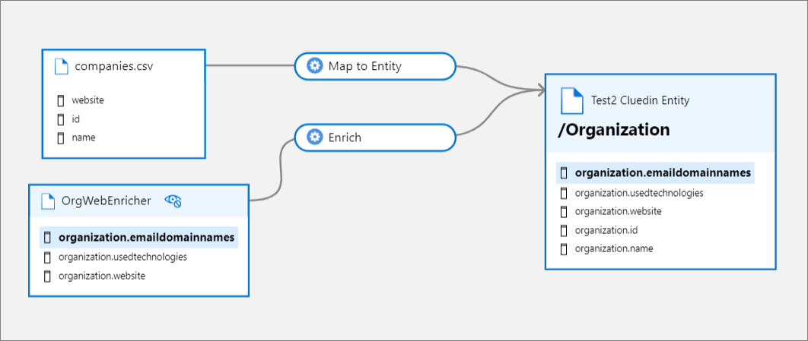

# Overview
CluedIn integrates with your Microsoft Purview instance to synchronize your assets, glossaries, and lineage of your data journey in CluedIn.

| Integration Feature | Description
| ---- | ------ |
| Polling Data Source | Update properties and metrics on existing "Cluedin Dataset" Purview entities
| Synchronize CluedIn Vocabularies to Purview Glossary Terms | Create Purview Glossary Terms from CluedIn Vocabularies
| Synchronize Data Sources | Create and update "Cluedin Ingest Process", "Cluedin Dataset", "Cluedin Map Process", and "Cluedin Entity" entities on Purview lineages that link Purview assets to CluedIn Data Sets and their matching CluedIn Entity Types
| Synchronize Purview Glossaries Terms To CluedIn Glossary Terms | Create CluedIn glossary terms from Purview glossary terms
| Synchronize Purview Glossary Terms To CluedIn Vocabularies | Create Purview glossary terms from CluedIn vocabulary
| Synchronize Streams | Create and update "Cluedin Entity", "Cluedin Stream Process", and "Cluedin Organization Provider" entities on Purview lineages that link CluedIn streams and connectors
| Synchronize Crawlers And Enrichers | Create and update "Cluedin Organization Provider", "Cluedin Crawl Process", "Cluedin Enrich Process", "Cluedin Ingest Process", "Cluedin Dataset", "Cluedin Map Process", and "Cluedin Entity" entities on Purview lineages that link Purview assets to CluedIn Data Sets and matching CluedIn Entity Types |

# Assumptions
Assumptions of what the customers have with their Microsoft Azure setup:
- Customers owns only one Purview resource.
- When ingesting data from ADF, the ADF pipeline should only does a one-to-one mapping from targeted file on Azure to API endpoint.

# Features

## Sync CluedIn Data Sources

When this feature is enabled, CluedIn fetches all Microsoft Purview asset entities from Purview to create Data Source Groups and their respective Data Sources. The Data Source Groups can be viewed under the Integrations pillar on the Data Sources page. The CluedIn purview integration components create purview assets under a single root collection.

CluedIn creates a lineage when one or more Data Sets are created within a Data Source associated with a Purview asset entity / previously created via _"Sync Data Sources"_ feature. An "Ingest Data" process displays data flow from the Microsoft Purview asset entity to a newly created or updated Microsoft Purview Data Set entity. The Microsoft Purview Data Set entity represents the CluedIn Data Set with its populated column names.

Data Sets in CluedIn with a mapping of at least one property to a CluedIn Entity Type results in both the CluedIn Entity and a "Map to Entity" process being created in Purview. The "Map to Entity" process connects the CluedIn Dataset to the CluedIn Entity Type under the assets lineage tab.

Example of a Data Set lineage

Background processes in CluedIn detect changes in CluedIn Data Sets and their respective mapping. These changes synchronized with the existing Microsoft Purview Data Set assets.

## Auto Map Data Sets

The _"Auto Map Data Sets"_ feature auto-maps data sets to a vocabulary matching the Purview asset's glossary term.
- The feature applies to data sets tied to Purview asset and has Purview glossary terms assigned to either the Purview asset itself or the schema columns.
- The Purview glossary terms used by the Purview assets must first be added as CluedIn vocabularies.
- If the vocabulary (made from Purview glossary terms) is available, the data set is automatically mapped to the right vocabulary.
- Sync interval applies to this feature.

## Polling Data sources

This feature differs from _"Sync Data Sources"_ by updating the existing Data Set entities on Microsoft Purview lineages without having to sync new data sources on Microsoft Purview back to CluedIn. Data Quality metrics for the associated data sources in CluedIn are also synced back to Microsoft Purview lineages this way.

## Sync Streams

A background processing CluedIn synchronizes streams and their respective export connector as assets in Purview. These assets show outbound lineage from CluedIn Entity Types to the export target.

## Monitor Events

CluedIn updates Microsoft Purview entities when specific actions are carried out by a user in CluedIn.
The supported actions are as follows:

- Adding or removing a CluedIn Data Source or Enrichers
- Adding, updating, reprocessing or removing a CluedIn Stream
- Adding, updating or removing a CluedIn Export Target

## Sync Microsoft Purview Glossaries to CluedIn Vocabularies

This synchronization feature allows the import of Microsoft Purview Glossaries as CluedIn vocabularies. If there are matching CluedIn vocabularies, they will be updated; otherwise, new CluedIn vocabularies are created for the incoming Microsoft Purview glossaries.

## Sync CluedIn Vocabularies to Purview Glossary Terms

![Purview glossary terms created under the root glossary term "CluedIn" + [Your machine name], ex. "CluedIn-Dell"](./media/vocab_to_glossary.png)
Purview glossary terms created under the root glossary term "CluedIn" + [Your machine name], ex. "CluedIn-Dell"

- By default, a "CluedIn" root glossary term is created in Purview glossaries.
- New glossary terms are created under the root glossary term.
- If a glossary term is deleted but the vocabulary or vocabulary key still exists, the sync re-creates the glossary term.
- If a vocabulary or vocabulary key is deleted, the linked glossary term is removed, except for glossary terms with assigned entities.
- If a newly created vocabulary or vocabulary key matches an existing glossary term, the name of the new glossary term is appended with numbers.

## Sync Purview Glossary Terms to CluedIn Glossary Terms

- A CluedIn glossary category with the default name "Purview" is automatically created when this feature is enabled. 
- The glossary category name is configurable via organization settings page.
- All Purview glossary terms (excluding names containg "CluedIn-" prefix) are synced under this glossary category.
- New glossary terms created under this glossary category are ignored.

## Sync Crawlers and Enrichers

The _"Sync Crawlers And Enrichers"_ feature will create or update existing crawlers and enricher lineages in Purview.

The "DataSource" provider types (data imported via files/endpoints/databases) are handled by the _"Sync Data Sources"_ feature.

Example of a Crawler lineage

When a Crawler imports clues into CluedIn, this feature creates a lineage from the Crawler provider to the Entity Types of the CluedIn entities via the "Crawl" process.

Example of a Enricher lineage

When an enricher enriches an entity, this feature creates a lineage from the Enricher provider to the Entity Types of the CluedIn entities via the "Enrich" process.

## Azure Data Factory pipeline Automation

This job will automatically create your ADF pipeline and execution to ingest data from Purview Asset source to CluedIn Ingestion Endpoint (CluedIn ADF Copy Data Automation).

