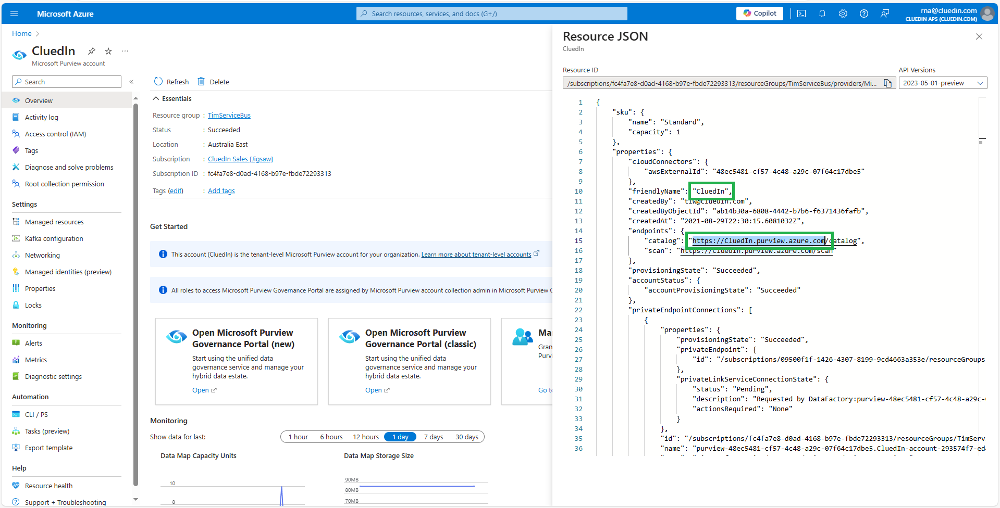

## On this page
{: .no_toc .text-delta }
- TOC
{:toc}

## Credentials

To connect CluedIn to Microsoft Purview, you need to provide the Microsoft Purview account and Service Principal account information.

In CluedIn, on the navigation pane, go to **Administration** > **Settings**, and then scroll down to find the **Purview** section.

### Enter Microsoft Purview credentials:

- **Base URL** – `https://{accountName}.purview.azure.com` where `accountName` is your Purview subscription name. For example, if your Purview subscription name is ContosoPurview, then the base URL would be `https://contosopurview.purview.azure.com`. For more details about Purview subscription, see [Microsoft documentation](https://docs.microsoft.com/en-us/azure/purview/create-catalog-portal#open-the-microsoft-purview-governance-portal).
- Another way to find the Base URL value is by navigating to your Purview Account home page and viewing the **Resource JSON**
    
- **Client ID** – can be obtained from **Application (client) ID** on the **Overview** tab of the app registration that the organization has dedicated to access Purview account on behalf of CluedIn.

- **Client Secret** – can be obtained from the **Certificates & secrets** of the app registration that the organization has dedicated to access Purview account on behalf of CluedIn.

- **Tenant ID** – can be obtained from **Directory (tenant) ID** on the **Overview** tab of the app registration that the organization has dedicated to access Purview account on behalf of CluedIn.

    

    For more information on where to find the values for client ID and tenant ID, see [Microsoft documentation](https://learn.microsoft.com/en-us/entra/identity-platform/quickstart-register-app#register-an-application).
