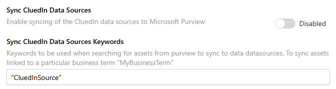
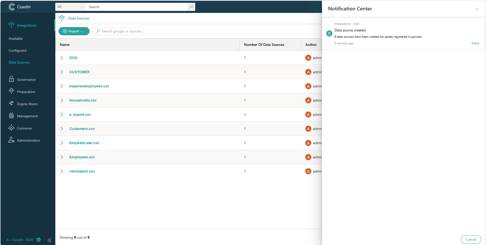
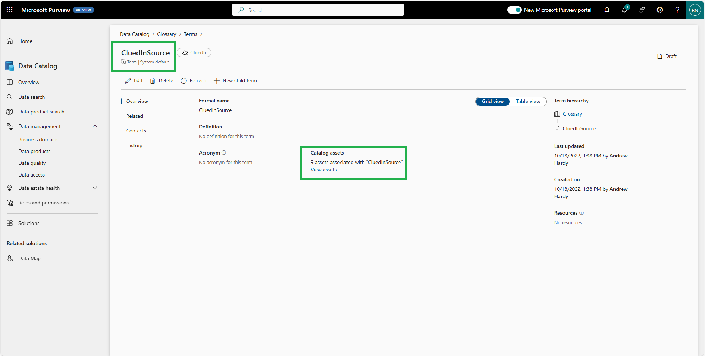
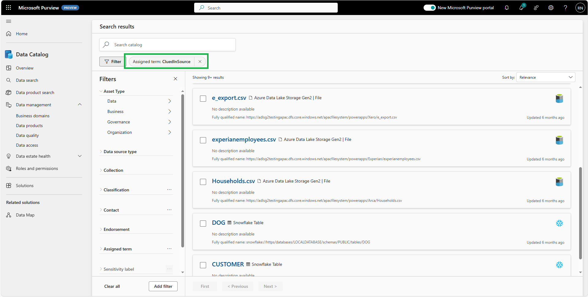

## On this page
{: .no_toc .text-delta }
- TOC
{:toc}

## Sync Purview Assets as CluedIn DataSources

When this feature is enabled, CluedIn fetches all Microsoft Purview asset entities from Purview to create data source groups and their respective data sources. The data source groups can be viewed in **Integrations** > **Data Sources**. The CluedIn Purview integration components create Purview assets under a single root collection.

The `Keywords` used from the above setting is the Glossary Term Name which is tagged into the Assets.

## Dataset Lineage

CluedIn creates a lineage when one or more data sets are created within a data source associated with a Purview asset entity previously created via the **Sync CluedIn Data Sources** feature. The **Ingest Data** process displays data flow from the Microsoft Purview asset entity to a newly created or updated Microsoft Purview data set entity. The Microsoft Purview data set entity represents the CluedIn data set with its populated column names.

Data sets in CluedIn with a mapping of at least one property to a CluedIn entity type result in both the CluedIn entity and the **Map to Entity** process being created in Purview. The **Map to Entity** process connects the CluedIn data set to the CluedIn entity type under the assets lineage tab.

The following image shows an example of a data set lineage.

Background processes in CluedIn detect changes in CluedIn data sets and their respective mapping. These changes are synchronized with the existing Microsoft Purview data set assets.
