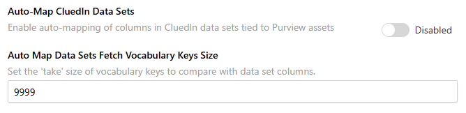

## On this page
{: .no_toc .text-delta }
- TOC
{:toc}

## Auto-Map CluedIn Data Sets

This feature auto-maps data sets to a vocabulary matching the Purview asset's glossary term. The feature applies to data sets tied to the Purview asset and has Purview glossary terms assigned to either the Purview asset itself or the schema columns.

The Purview glossary terms used by the Purview assets must first be added as CluedIn vocabularies. If the vocabulary (made from Purview glossary terms) is available, the data set is automatically mapped to the right vocabulary.

If the CluedIn data set column name matches an existing vocabulary key of the given vocabulary, the vocabulary key data type is used instead of the Purview entity's schema. If the CluedIn data set column name does not match any existing vocabulary key of the given vocabulary, it will create a new vocabulary key for the vocabulary. The data type of the vocabulary key is determined from the Purview entity's schema.

The default data type is text when no suitable data type in CluedIn is found.

Sync interval applies to this feature.

## Requirements
