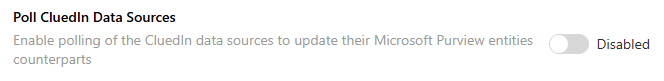

## On this page
{: .no_toc .text-delta }
- TOC
{:toc}

## Poll CluedIn Data Sources

This feature differs from **Sync CluedIn Data Sources** by updating the existing data set entities on Microsoft Purview lineages without having to sync new data sources on Microsoft Purview back to CluedIn. Data quality metrics for the associated data sources in CluedIn are also synced back to Microsoft Purview lineages this way.
