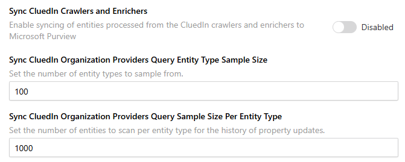

## On this page
{: .no_toc .text-delta }
- TOC
{:toc}

## Sync CluedIn Crawlers and Enrichers

This feature will create or update existing crawlers and enricher lineages in Purview. The **DataSource** provider types (data imported via files, endpoints, or databases) are handled by the **Sync CluedIn Data Sources** feature.

The following image shows an example of a crawler lineage.

When a Crawler imports clues into CluedIn, this feature creates a lineage from the Crawler provider to the entity types of the CluedIn entities via the **Crawl** process.

The following image shows an example of an enricher lineage.

When an enricher enriches an entity, this feature creates a lineage from the enricher provider to the entity types of the CluedIn entities via the **Enrich** process.

