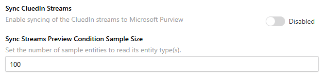
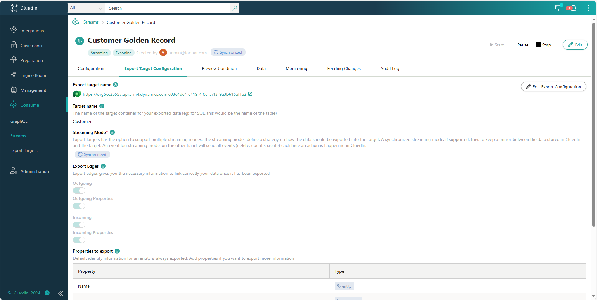
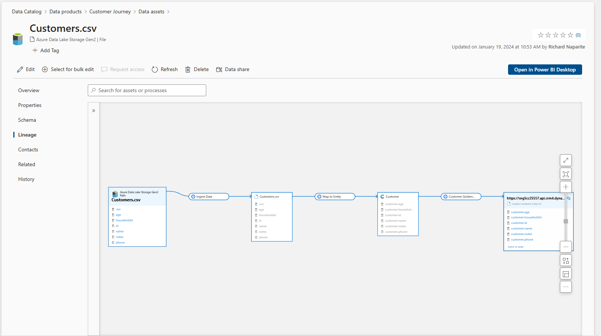
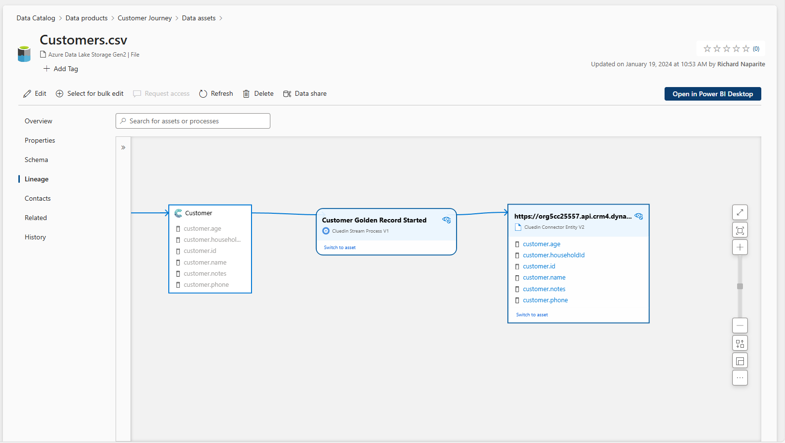

## On this page
{: .no_toc .text-delta }
- TOC
{:toc}

## Sync CluedIn Streams

A background processing in CluedIn synchronizes streams and their respective export connector as assets in Purview. These assets show outbound lineage from CluedIn entity types to the export target.

Details of CluedIn Streams named as `Customer Golden Record` with Export Target configured with Target name `Customer`

Full Lineage of Purview Asset to CluedIn Stream

CluedIn Stream created as a Process Asset and Export Target as the Entity Asset.

