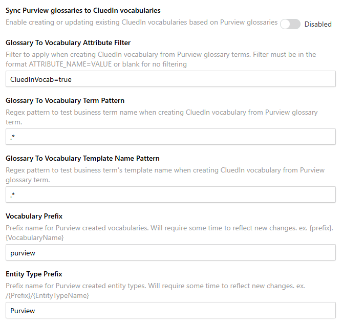
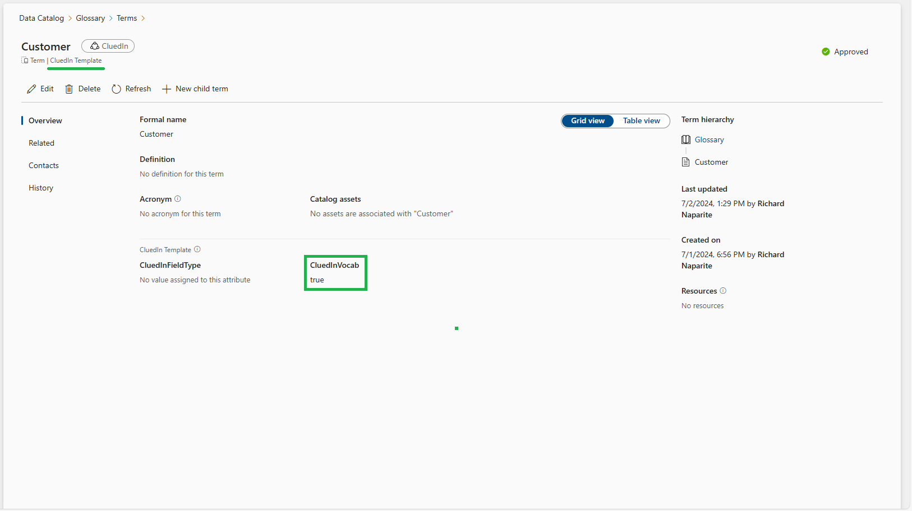
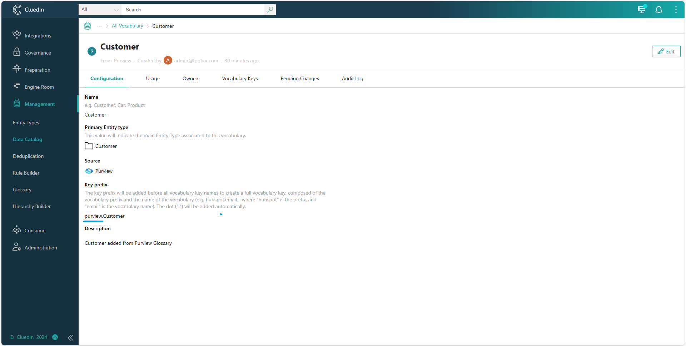
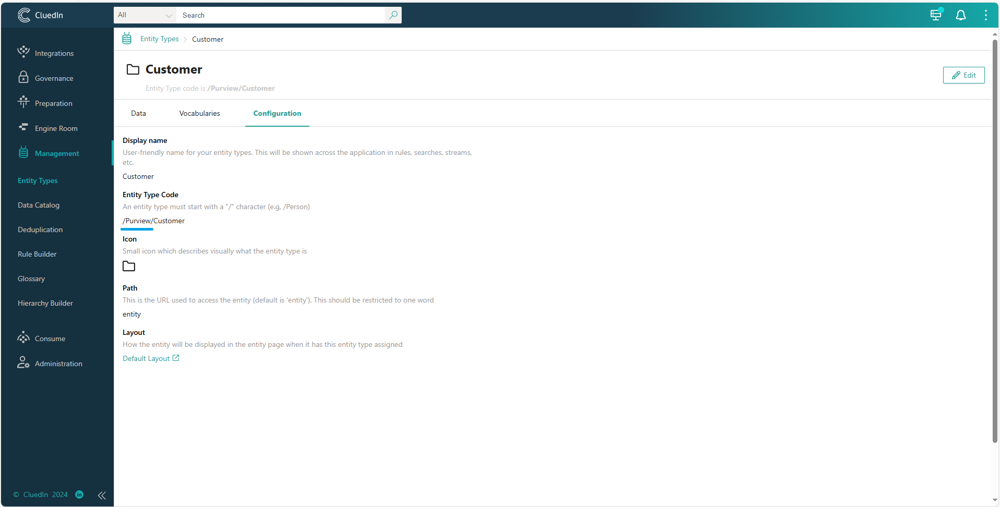
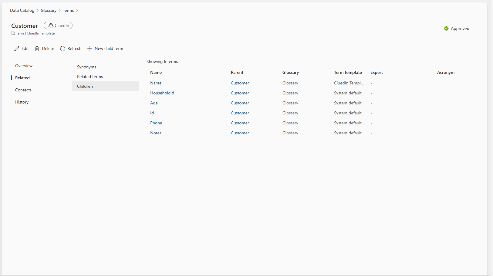
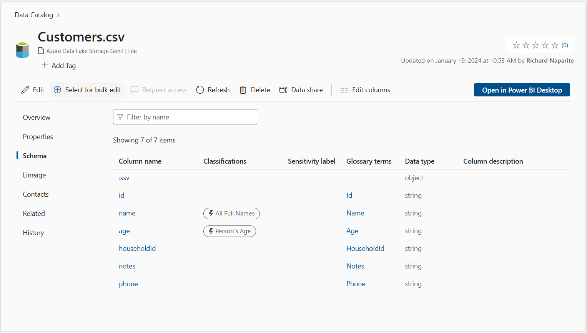
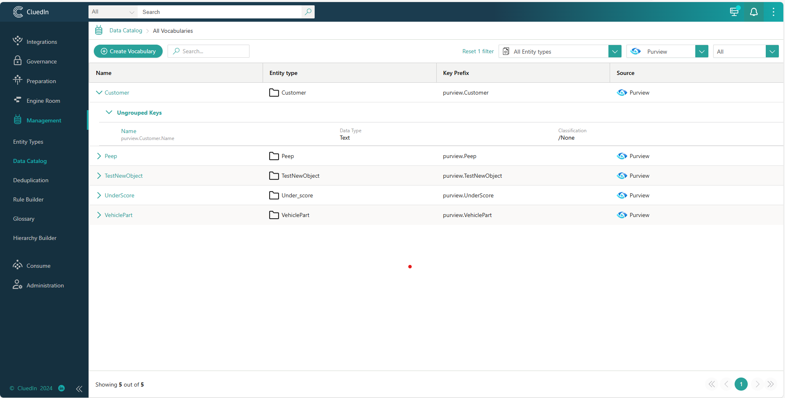

## On this page
{: .no_toc .text-delta }
- TOC
{:toc}

This synchronization feature allows the import of Microsoft Purview glossaries as CluedIn vocabularies. If there are matching CluedIn vocabularies, they will be updated; otherwise, new CluedIn vocabularies are created for the incoming Microsoft Purview glossaries.

## Syncronization Settings

#### **Sync Purview glossaries to CluedIn vocabularies**
When this feature is enabled, the job will start to look in Purview Glossaries and Create a CluedIn Vocabularies if the requirements have been met.

#### **Glossary To Vocabulary Attribute Filter**

Key Value pair of Property Name and Value to filter the Glossary Terms. `CluedInVocab` is an additional property from `CluedIn Template` Template.

#### **Glossary To Vocabulary Term Pattern**

Regex Pattern value used to filter the Glossary Terms by Name or NickName 

#### **Glossary To Vocabulary Template Name Pattern**

Regex Pattern value used to filter the Glossary Terms by Template Name

#### **Vocabulary Prefix**

Assign a custom value for the Vocabulary Key prefix.

#### **EntityType Prefix**

Assign a custom value for the EntityType prefix for identifying the EntityType if it's created under Purview Integration.

## Sample Previews
Created a Glossary Term `Customer` with Children Glossary Terms `Name`, `HouseholdId`, `Age`, `Id`, `Phone` and `Notes`

Assigned the Children Glossary Term to Purview Asset Schema

When Synchronization is done, notice that `Customer` Vocabulary has been created with `Name` only as its Vocabulary Key.

The reason for this is that Glossary Terms `Customer` and `Name` are the only terms that have been assigned with `CluedInVocab=true` value in its property.