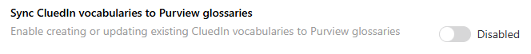

## On this page
{: .no_toc .text-delta }
- TOC
{:toc}

## Sync CluedIn Vocabularies to Purview Glossaries

![Purview glossary terms created under the root glossary term "CluedIn" + [Your machine name], ex. "CluedIn-Dell"](../media/vocab_to_glossary.png)

Purview glossary terms are created under the root glossary term "CluedIn" + [Your machine name] (e,g. "CluedIn-Dell").

By default, a CluedIn root glossary term is created in Purview glossaries. New glossary terms are created under the root glossary term.

If a glossary term is deleted but the vocabulary or vocabulary key still exists, the sync re-creates the glossary term. If a vocabulary or vocabulary key is deleted, the linked glossary term is removed, except for glossary terms with assigned entities. If a newly created vocabulary or vocabulary key matches an existing glossary term, the name of the new glossary term is appended with numbers.
