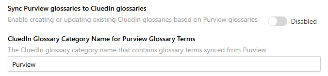
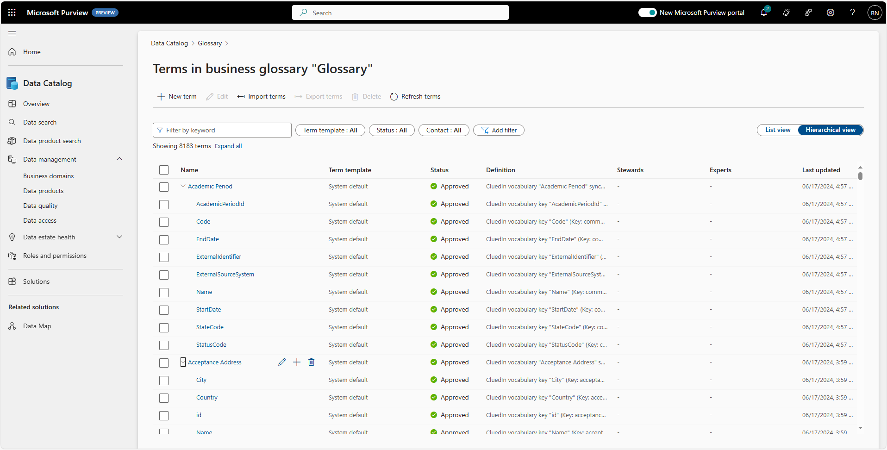
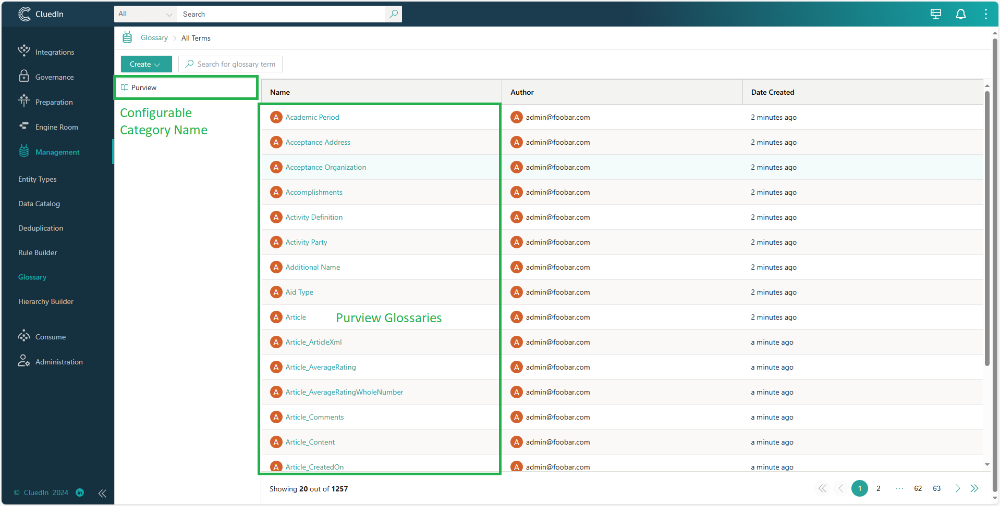

## On this page
{: .no_toc .text-delta }
- TOC
{:toc}

## Sync Purview Glossaries to CluedIn Glossaries

When this feature is enabled, a CluedIn glossary category with the default name **Purview** is automatically created. The glossary category name is configurable in **Organization** > **Settings**. All Purview glossary terms (excluding names containing "CluedIn-" prefix) are synced under this glossary category. New glossary terms created under this glossary category are ignored.

### Purview Glossaries

### CluedIn Glossaries after Sync

