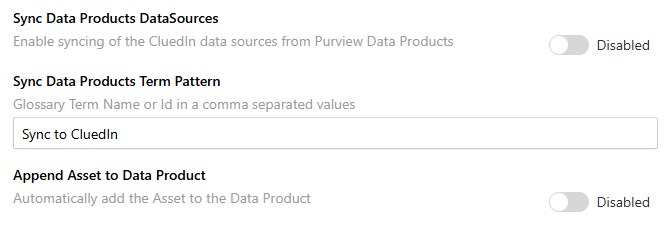
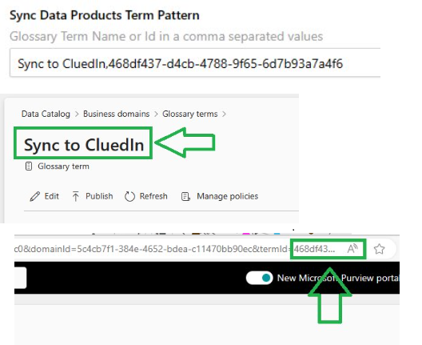
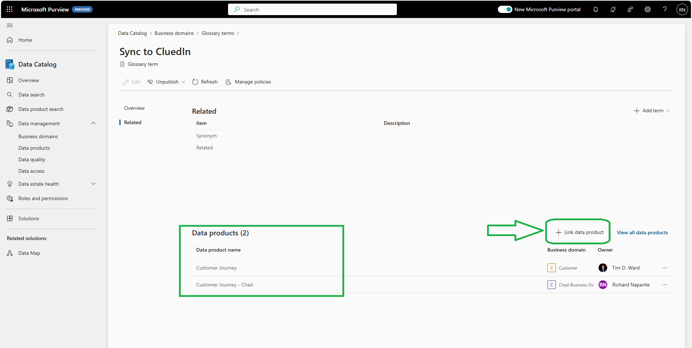
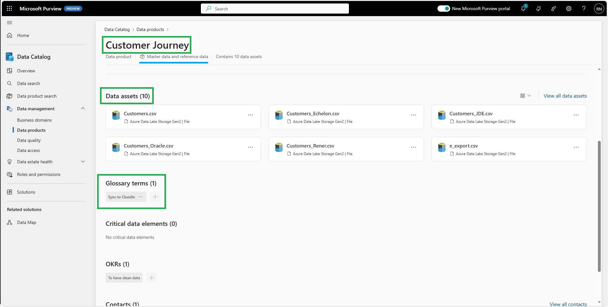
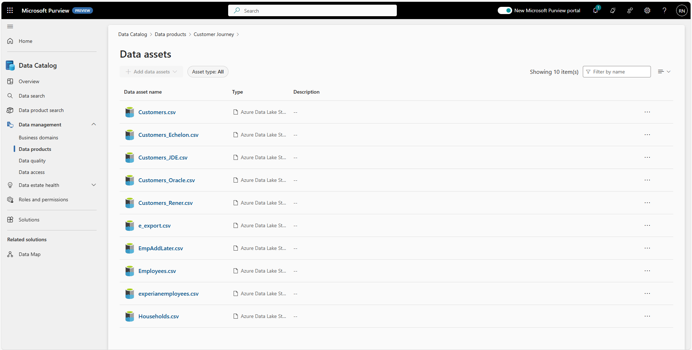
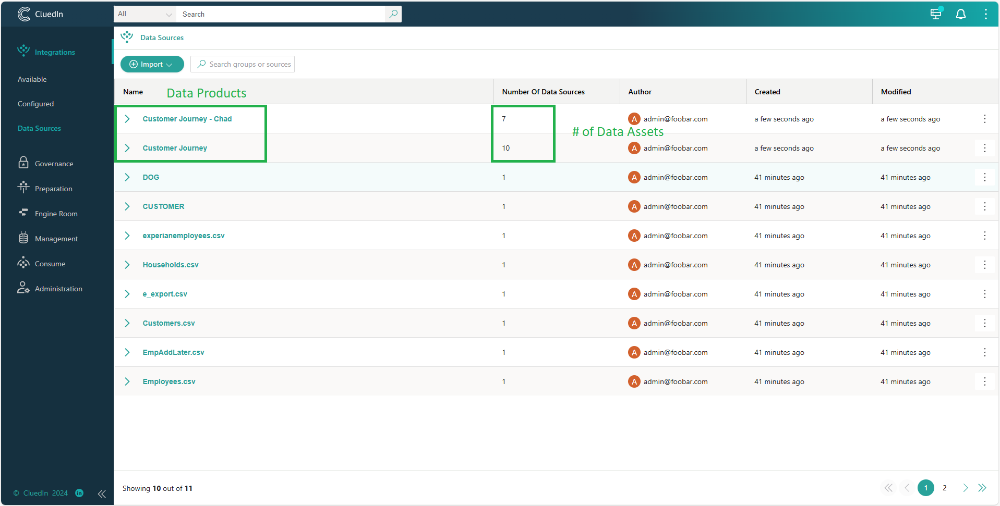
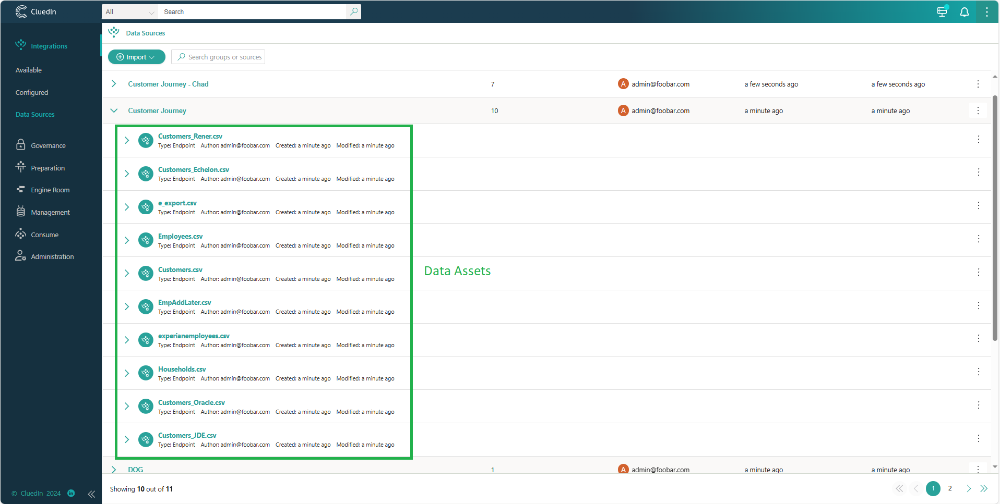
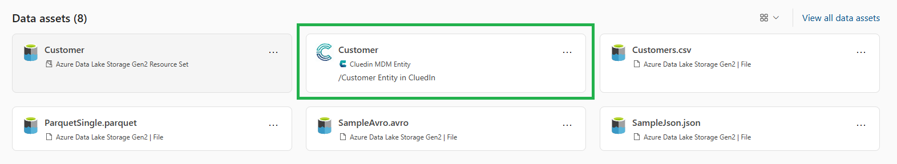

## On this page
{: .no_toc .text-delta }
- TOC
{:toc}

## Sync Data Products Settings

This feature will enable you to sync the Purview Data Products and Data Assets into CluedIn DataSources. The data source groups can be viewed in **Integrations** > **Data Sources**.

## Sync Data Products by Glossary Term
There are 2 ways to select the Glossary Term that you want to sync.

1. By providing the Glossary Term ID, which can be found in the Url path.

1. By providing the Glossary Term Name. In case you implemented a multiple glossary term with the same name.

#### Link Glossary Term to Data Product

In the Glossary Term Page, you can see a `Link `data product` on the right-hand side of the screen.

## Purview Data Product Preview

Let's break down the details we can see in the Purview Data Product Page

- Data Product name - **Customer Journey**
- Data Product Type - **Master data and reference data**
- Data Assets Count - **10** 
- Linked Glossary Term - **Sync to CluedIn**

Navigating to the list of associated Data Assets to the Data Product

## CluedIn Syncronization

When the CluedIn Job executes and synchronizes the Purview Data Products to CluedIn. New `DataSources` will be created.

Requirements to Sync
- Data Product Status must be **_Published_**
- Data Product Type must be **_Master data and Reference data_**
- Data Product must be in a valid Glossary Term _(see next section below)_

## Append Asset to Data Product

As we write back to Purview the CluedIn Assets, we are now able to easily see the Assets we are creating by adding this into the associated Data Product that we synchronize.

Requirements to Sync

- `Service Principal` must be in the Business Domain Role **Data Product Owner**. Please see the _Setup Permissions_ document.