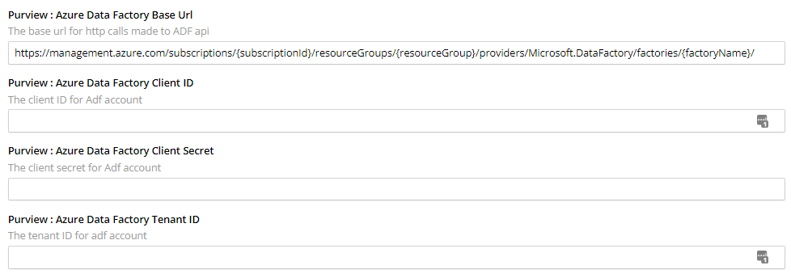
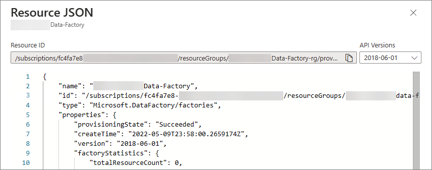

## On this page
{: .no_toc .text-delta }
- TOC
{:toc}

## Azure Data Factory setup

Azure Data Factory integration is enabled on the **Settings** page in CluedIn. When the fields are left empty, no synchronization is performed with Azure Data Factory.

### Role Assignment

To enable the automation of ADF Pipeline, we need to assign a _**Reader**_ Role for the Service Principal. Please refer to this [link](https://learn.microsoft.com/en-us/purview/troubleshoot-connections) for more details.

## To connect CluedIn to Azure Data Factory

1. In CluedIn, go to **Administration** > **Settings**, and then scroll down to find the **Purview** section.

    

1. Enter [Microsoft Azure Data Factory Credentials](https://learn.microsoft.com/en-us/azure/data-factory/quickstart-create-data-factory):

    - **Base URL** – `https://management.azure.com/subscriptions/{subscriptionId}/resourceGroups/{resourceGroup}/providers/Microsoft.DataFactory/factories/{factoryName}/`. You can get the resource ID value by navigating to your Azure Data Factory resource and checking the value through JSON View.

        
    
    - **Client ID**, **Client Secret**, **Tenant ID** – you can get these values by navigating to your Azure Active Directory > App registration. For more information, see [Microsoft documentation](https://learn.microsoft.com/en-us/power-apps/developer/data-platform/walkthrough-register-app-azure-active-directory).

## Automation Feature
1. Enable the **Azure Data Factory Pipeline Automation** feature.

2. Enter the **ADF Pipeline Automation Term Pattern** to filter the asset that you want to automate.

    

    The same procedure with `Sync Datasources`, you also need to assign a Glossary Term to the asset to identify which asset you want to automate the pipeline creation to ingest to CluedIn DataSet.

    

    

    But for the Data Product synchronization, as this is already grouped and managed within the Business Domain, no need to assign the Glossary Term and the automation of the pipeline will kick in immediately.

3. Once the ADF Automation is done, the data will start to come forward to our ingestion endpoint. Some examples below are the creations of CluedIn Ingestion Endpoint for Assets.

    

    With Data ingested via ADF Pipeline

    

    Data Product - Data Assets creation of Ingestion Endpoint
    
    
    
## Azure Data Factory automation coverage

- Azure SQL Server

- Azure Data Lake gen 2 (Avro, DelimitedText, Excel, JSON, ORC, Parquet, XML)

- Azure File (Avro, DelimitedText, Excel, JSON, ORC, Parquet, XML)

- Snowflakes

- SQL Server