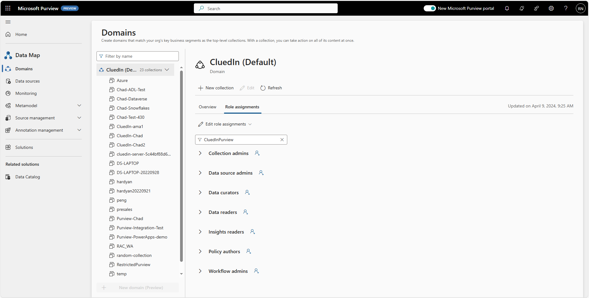
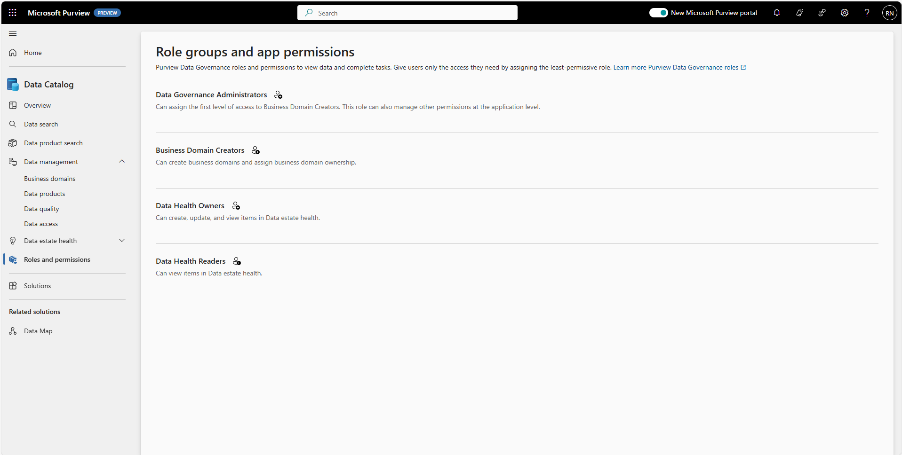
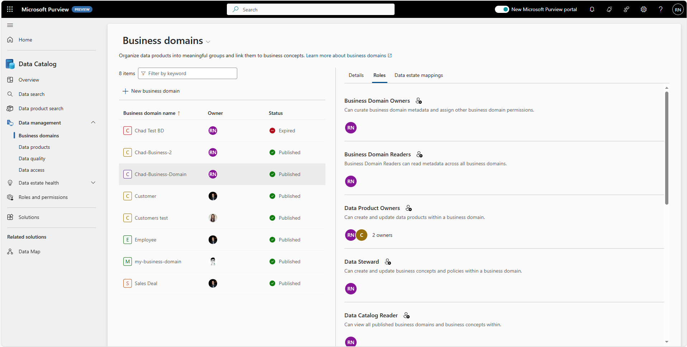
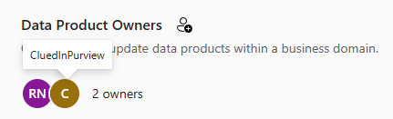

## On this page
{: .no_toc .text-delta }
- TOC
{:toc}

## Microsoft Purview setup

Microsoft Purview integration is enabled on the **Settings** page in CluedIn. When the fields are left empty, no synchronization is performed with Microsoft Purview.

**To connect CluedIn to Microsoft Purview**

1. In CluedIn, go to **Administration** > **Settings**, and then scroll down to find the **Purview** section.

3. Choose to enable one or more [features](/microsoft-integration/purview/introduction) for your use cases:

    - Sync CluedIn Data Sources
    - Sync CluedIn Crawlers and Enrichers
    - Sync CluedIn Streams
    - Sync Purview glossaries to CluedIn vocabularies
    - Sync CluedIn vocabularies to Purview glossaries
    - Sync CluedIn vocabularies to Purview glossaries Root Glossary Term
    - Sync Purview glossaries to CluedIn glossaries
    - Sync Data Products DataSources
    - Poll CluedIn Data Sources

## Minimum permission requirements

The following table lists the Purview roles ([permissions](https://learn.microsoft.com/en-us/azure/purview/catalog-permissions)) that CluedIn requires per integration feature. Roles assignments can be found under the **Role assignments** tab of each collection in Purview.
  
  

| Integration feature | Role | Collection Level |
| ---- | ------ | ------- |
| Synchronize Data Sources | Data Curator | Target Collection |
| Synchronize Data Sources | Data Reader | Root Collection |
| Polling Data Sources | Data Curator | Target Collection |
| Synchronize CluedIn Vocabularies to Purview Glossary Terms | Data Curator | Target Collection |
| Synchronize Purview Glossaries Terms To CluedIn Glossary Terms | Data Reader | Root Collection |
| Synchronize Purview Glossary Terms To CluedIn Vocabularies | Data Reader | Root Collection |
| Synchronize Streams | Data Curator | Target Collection |
| Synchronize Streams | Data Reader | Root Collection |
| Synchronize Crawlers And Enrichers | Data Curator | Target Collection |
| Azure Data Factory Pipeline Automation | Data source admins | Root Collection |

Collection levels:

- **Root-collection** – refers to the top most collection of your Microsoft Purview instance.

- **Target-collection** – refers to the **Collection Name** specified in CluedIn's organization settings.

## Microsoft Purview (Preview)

### Data Catalog - Roles and permissions

**Business Domain Preparations**
- As we navigate within the Business Domain of the Data Catalog, assigning the right permissions helps the integration do its job right.
- Assign your `Service Principal` to the **Business Domain Creators**.

### Business Domain - Roles

### Append Asset to Data Product

- The Integration is writing back to Purview the Data Assets for CluedIn.
- Assign your `Service Principal` to the **Data Product Owner**.

  
