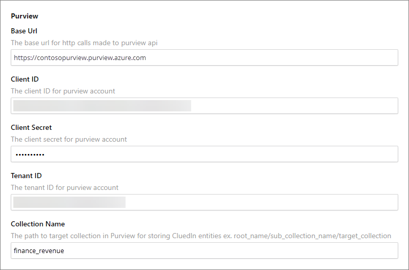
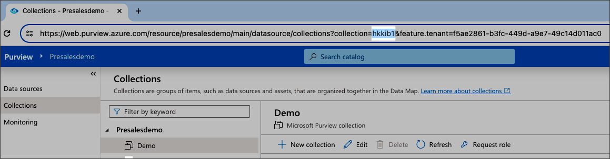
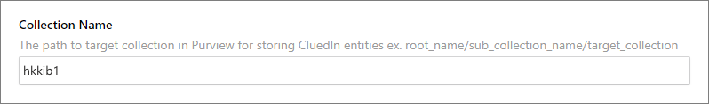
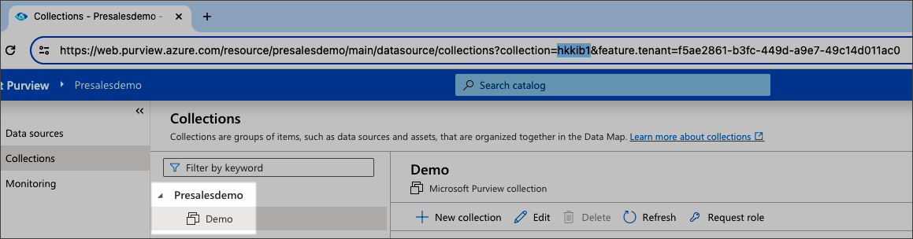
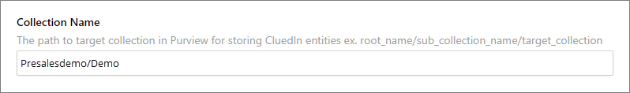
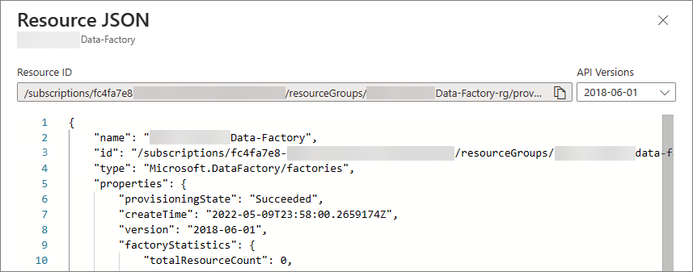
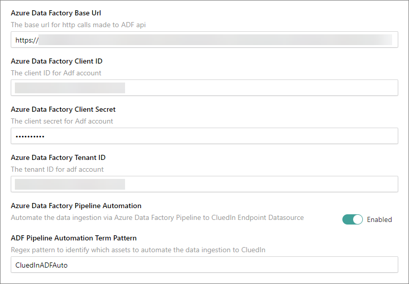

## On this page
{: .no_toc .text-delta }
- TOC
{:toc}

## Microsoft Purview setup

Microsoft Purview integration is enabled on the **Settings** page in CluedIn. When the fields are left empty, no synchronization is performed with Microsoft Purview.

**To connect CluedIn to Microsoft Purview**

1. In CluedIn, go to **Administration** > **Settings**, and then scroll down to find the **Purview** section.

1. Enter Microsoft Purview credentials:

    - **Base URL** – `https://{accountName}.purview.azure.com` where `accountName` is your Purview subscription name. For example, if your Purview subscription name is ContosoPurview, then base URL would be `https://contosopurview.purview.azure.com`. For more details about Purview subscription, see [Microsoft documentation](https://docs.microsoft.com/en-us/azure/purview/create-catalog-portal#open-the-microsoft-purview-governance-portal).
    
    - **Client ID** – can be obtained from **Application (client) ID** on the **Overview** tab of the app registration that the organization has dedicated to access Purview account on behalf of CluedIn.
    
    - **Client Secret** – can be obtained from the **Certificates & secrets** of the app registration that the organization has dedicated to access Purview account on behalf of CluedIn.
    
    - **Tenant ID** – can be obtained from **Directory (tenant) ID** on the **Overview** tab of the app registration that the organization has dedicated to access Purview account on behalf of CluedIn.

        

        For more information on where to find the values for client ID and tenant ID, see [Microsoft documentation](https://learn.microsoft.com/en-us/entra/identity-platform/quickstart-register-app#register-an-application).

2. In **Collection Name**, enter one of the following:

    - The ID of the collection in Purview. You can find this ID in the Purview collection's URL.

        

        Based on the screenshot above, the collection name would be "hkkib1".

        

    - The path from the topmost collection to the intended collection in Purview. The example pattern is as follows: root_collection_name/sub_collection_1/sub_collection_2/target_collection_name.

        
    
        Based on the screenshot above, the collection name would be "Presalesdemo/Demo".

        
     
3. Choose to enable one or more [features](/microsoft-integration/purview/introduction) for your use cases:

    - Sync CluedIn Data Sources
    - Sync CluedIn Crawlers and Enrichers
    - Sync CluedIn Streams
    - Sync Purview glossaries to CluedIn vocabularies
    - Sync CluedIn vocabularies to Purview glossaries
    - Sync CluedIn vocabularies to Purview glossaries Root Glossary Term
    - Sync Purview glossaries to CluedIn glossaries
    - Sync Data Products DataSources
    - Poll CluedIn Data Sources

## Minimum permission requirements

The following table lists the Purview roles ([permissions](https://learn.microsoft.com/en-us/azure/purview/catalog-permissions)) that CluedIn requires per integration feature. Roles assignments can be found under the **Role assignments** tab of each collection in Purview.

| Integration feature | Role | Collection Level |
| ---- | ------ | ------- |
| Polling Data Sources | Data Curator | Target Collection |
| Synchronize CluedIn Vocabularies to Purview Glossary Terms | Data Curator | Target Collection |
| Synchronize Data Sources | Data Curator | Target Collection |
| Synchronize Data Sources | Data Reader | Root Collection |
| Synchronize Purview Glossaries Terms To CluedIn Glossary Terms | Data Reader | Root Collection |
| Synchronize Purview Glossary Terms To CluedIn Vocabularies | Data Reader | Root Collection |
| Synchronize Streams | Data Curator | Target Collection |
| Synchronize Streams | Data Reader | Root Collection |
| Synchronize Crawlers And Enrichers | Data Curator | Target Collection |

Collection levels:

- **Root-collection** – refers to the top most collection of your Microsoft Purview instance.

- **Target-collection** – refers to the **Collection Name** specified in CluedIn's organization settings.

## Azure Data Factory setup

Azure Data Factory integration is enabled on the **Settings** page in CluedIn. When the fields are left empty, no synchronization is performed with Azure Data Factory.

**To connect CluedIn to Azure Data Factory**

1. In CluedIn, go to **Administration** > **Settings**, and then scroll down to find the **Purview** section.

1. Enter [Microsoft Azure Data Factory Credentials](https://learn.microsoft.com/en-us/azure/data-factory/quickstart-create-data-factory):

    - **Base URL** – `https://management.azure.com/subscriptions/{subscriptionId}/resourceGroups/{resourceGroup}/providers/Microsoft.DataFactory/factories/{factoryName}/`. You can get the resource ID value by navigating to your Azure Data Factory resource and checking the value through JSON View.

        
    
    - **Client ID**, **Client Secret**, **Tenant ID** – you can get these values by navigating to your Azure Active Directory > App registration. For more information, see [Microsoft documentation](https://learn.microsoft.com/en-us/power-apps/developer/data-platform/walkthrough-register-app-azure-active-directory).

1. Enable the **Azure Data Factory Pipeline Automation** feature.

1. Enter the **ADF Pipeline Automation Term Pattern** to filter the asset that you want to automate.

    

## Azure Data Factory automation coverage

- Azure SQL Server

- Azure Data Lake gen 2

- Azure File (in progress)