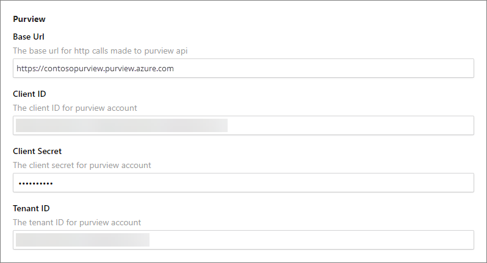

## On this page
{: .no_toc .text-delta }
- TOC
{:toc}

## Microsoft Purview setup

Microsoft Purview integration is enabled on the **Settings** page in CluedIn. When the fields are left empty, no synchronization is performed with Microsoft Purview.

**To connect CluedIn to Microsoft Purview**

1. In CluedIn, go to **Administration** > **Settings**, and then scroll down to find the **Purview** section.

1. Enter [Microsoft Purview credentials](https://docs.microsoft.com/en-us/azure/purview/create-catalog-portal#open-the-microsoft-purview-governance-portal): **Base URL**, **Client ID**, **Client Secret**, and **Tenant ID**.

2. In **Collection Name**, enter the target collection path of your Purview instance. For example, root_collection/collection1/targetcollection.

    
     
3. Enable the needed synchronization [features](/microsoft-integration/purview/introduction):

    - Sync CluedIn Data Sources
    - Sync CluedIn Crawlers and Enrichers
    - Sync CluedIn Streams
    - Sync Purview glossaries to CluedIn vocabularies
    - Sync CluedIn vocabularies to Purview glossaries
    - Sync CluedIn vocabularies to Purview glossaries Root Glossary Term
    - Sync Purview glossaries to CluedIn glossaries
    - Sync Data Products DataSources
    - Poll CluedIn Data Sources

## Minimum permission requirements

The following table lists the Purview roles ([permissions](https://learn.microsoft.com/en-us/azure/purview/catalog-permissions)) that CluedIn requires per integration feature. Roles assignments can be found under the **Role assignments** tab of each collection in Purview.

| Integration feature | Role | Collection Level |
| ---- | ------ | ------- |
| Polling Data Sources | Data Curator | Target Collection |
| Synchronize CluedIn Vocabularies to Purview Glossary Terms | Data Curator | Target Collection |
| Synchronize Data Sources | Data Curator | Target Collection |
| Synchronize Data Sources | Data Reader | Root Collection |
| Synchronize Purview Glossaries Terms To CluedIn Glossary Terms | Data Reader | Root Collection |
| Synchronize Purview Glossary Terms To CluedIn Vocabularies | Data Reader | Root Collection |
| Synchronize Streams | Data Curator | Target Collection |
| Synchronize Streams | Data Reader | Root Collection |
| Synchronize Crawlers And Enrichers | Data Curator | Target Collection |

Collection levels:

- **Root-collection** – refers to the top most collection of your Microsoft Purview instance.

- **Target-collection** – refers to the **Collection Name** specified in CluedIn's organization settings.

## Azure Data Factory setup

Azure Data Factory integration is enabled on the **Settings** page in CluedIn. When the fields are left empty, no synchronization is performed with Azure Data Factory.

**To connect CluedIn to Azure Data Factory**

1. In CluedIn, go to **Administration** > **Settings**, and then scroll down to find the **Purview** section.

1. Enter [Microsoft Azure Data Factory Credentials](https://learn.microsoft.com/en-us/azure/data-factory/quickstart-create-data-factory): **Base URL**, **Client ID**, **Client Secret**, and **Tenant ID**.

1. Enable the **Azure Data Factory Pipeline Automation** feature.

1. Enter the **ADF Pipeline Automation Term Pattern** to filter the asset that you want to automate.

    

## Azure Data Factory automation coverage

- Azure SQL Server

- Azure Data Lake gen 2

- Azure File (in progress)