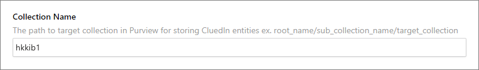

## On this page
{: .no_toc .text-delta }
- TOC
{:toc}

## Collection Name

Setting up the Collection name in CluedIn-Purview Integration is required as this will be the destination of all the `Asset`, `Process` and `Lineage` created by CluedIn.

### Administration Settings

In CluedIn, go to **Administration** > **Settings**, and then scroll down to find the **Purview** section.

In **Collection Name**, enter one of the following:

- The ID of the collection in Purview. You can find this ID in the Purview collection's URL.

    

    Based on the screenshot above, the collection name would be "hkkib1".

    

- The path from the topmost collection to the intended collection in Purview. The example pattern is as follows: root_collection_name/sub_collection_1/sub_collection_2/target_collection_name.

    

    Based on the screenshot above, the collection name would be "Presalesdemo/Demo".

    

### Required Permission

As we are trying to read, validate the collection value/path and write back the CluedIn Purview objects, we need to setup the permission of the `Service Principal` in the `Target Collection`. To do this,
- In **Purview Data Map** => Domains, navigate to the collection you want to use in the integration
- Go to **Role assignment** tab
- Add the `Service Principal` used in the **Collection admins**

    

## Business Domain

A business domain is a new concept in Microsoft Purview that provides context for your data assets and makes it easier to scale data governance practices.

We need to give the `Service Principal` account full access in this field as we are going to navigate in this module. Add the `Service Principal` account to `Business Domain Creators`. See the Setup Permission page for more info.
