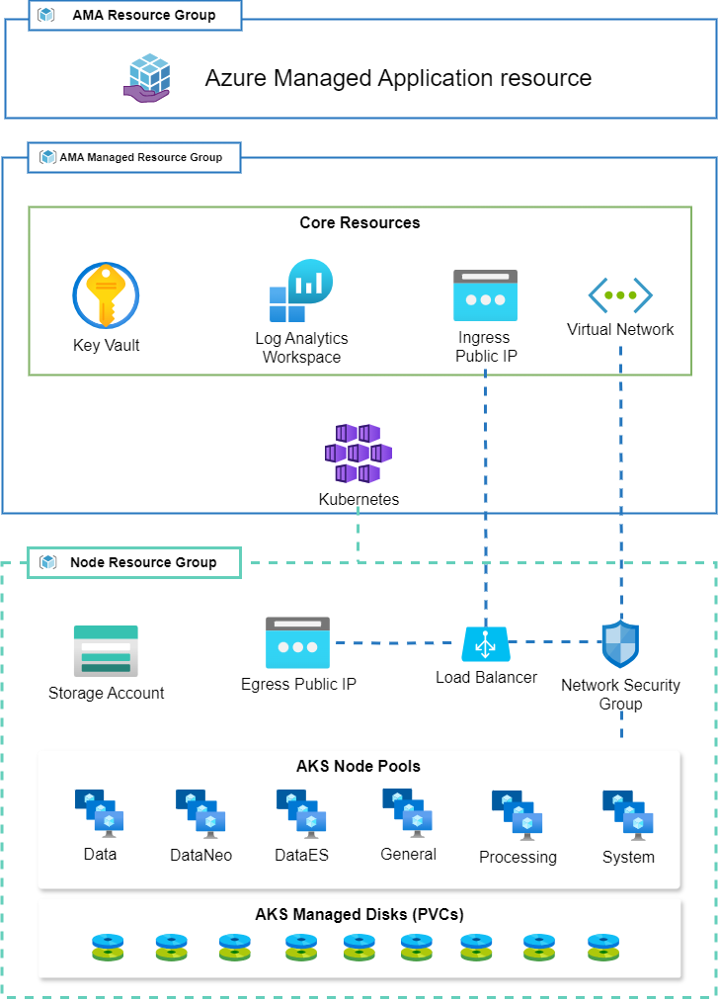

Below is a high-level design of what gets deployed from the Azure Marketplace Application (AMA) wizard and what you can expect after installing the product. 

For a detailed design surrounding the networking, please visit [Advanced network configuration](/deployment/infra-how-tos/advanced-network)