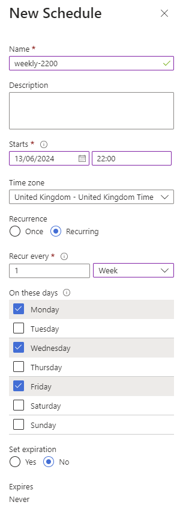

## On this page
{: .no_toc .text-delta }
1. TOC
{:toc}

## Set up a backup solution

To prevent data loss and to ensure the safety and availability of your containerized applications, set up a backup solution for your Azure Kubernetes Service (AKS) clusters. The backup solution is deployed post-installation and can be done by CluedIn on your behalf. If you do not have the backup solution in place, reach out to CluedIn support for assistance.

The backup configuration focuses on two core elements for the CluedIn product. These are the `helm values` and the persistent `databases` that run inside of your cluster on disk.

The process works by leveraging the automation account deployed to your managed resource group to run two main runbooks. One runbook will back up helm, and the other will back up the databases.

During the backup run, it will temporarily shut down the instance by scaling down all the pods running in Kubernetes to prevent any potential data loss. It will then take snapshots of each persistent disk and place these inside the managed resource group by default.

Once a backup has happened, it will reduce total snapshots to the supplied retention count (default is 7), starting with the oldest existing snapshot before scaling CluedIn up.

This process takes roughly 20 minutes to complete and is highly recommended to run out of hours.

**To set up the schedules**
1. Navigate to the automation account located in the managed resource group of the environment that you want to back up. 
1. On the left side, select **Schedules**
1. Select **Add a schedule**, and then specify the appropriate time, time zone, and days to run the backup. Then, select **Create**.

   

1. On the left side, select **Runbooks**
1. Select `backup-helm-values`. Then, on the left side, select **Schedules**.
1. Select **Add a schedule**, and then select the schedule that you've just created. Fill in the parameters.
1. Repeat the process for `backup-cluedin`.

Once this has been set, the automation account should proceed to backup as per your configuration.

For any further information about backup, reach out to CluedIn support.

## Restore an environment
If you're ever in a situation where you need to restore an environment, this section will only cover an in-place restore, and not a disaster recovery to another region. It is highly recommended to reach out to CluedIn support in the first instance. 

**To restore an environment**
1. Scale down the pods on your AKS so no CluedIn pods are running.
1. Restore the disks in the snapshot location over top of the existing PVCs.

   {:.important}
   The disk name and tags must match during a restore, otherwise you may run into problems during operation.
   All restored disks must be from the same time. There may be a few minutes between each disk as it runs sequentially.

1. Once all disks have been restored from the same time , it is then safe to scale the cluster back up.
1. After 5 minutes, the instance should then be rolled back.

# Further information
If you require further information at any point regarding the above, please reach out to CluedIn support who will assist.