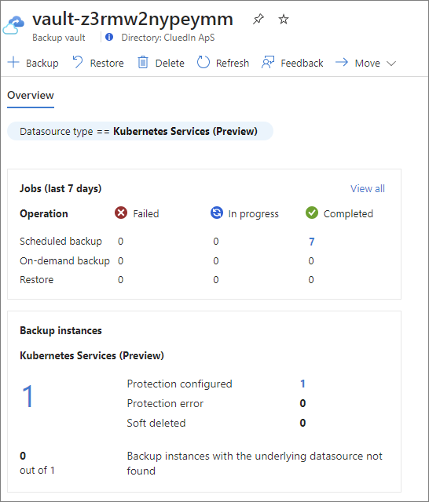

## On this page
{: .no_toc .text-delta }
1. TOC
{:toc}

To prevent data loss and to ensure the safety and availability of your containerized applications, set up a backup solution for your Azure Kubernetes Service (AKS) clusters. Note that the backup configuration is not included with AMA and requires a separate setup. This guide applies to setting up a backup solution for both newly installed CluedIn AMA and older installations.

The backup configuration process involves two main parts:

1. [Template deployment](#template-deployment)

1. [Backup extension configuration script](#backup-extension-configuration-script)

**Prerequisite:** Make sure you have the Owner access at the subscription level because some role assignments are performed when running the template and the extension script.

After you complete the backup configuration, you can [restore any backup instance](#restore-a-backup-instance). 

By default, backup occurs every 4 hours and typically lasts about 15 minutes. It does not cause service interruption to ensure that the data volumes are backed up. However, relying on the default schedule could lead to data inconsistency if there is any in-transit data processing in memory. That's why you can configure the cron job backup schedule to your preferred time frame. This custom schedule may temporarily pause system operations during backup processes to prevent data inconsistency.

The following diagram illustrates AKS backup configuration and the restoration of backup instances.


## Template deployment

Template deployment creates a storage account, backup vault, policies, instances, and sets up the required roles and permissions between AKS and the backup vault.

**To deploy a template**

1. Run the following Azure CLI command to enable the managed identity for the AKS cluster:

    ```bash
    az aks update -g <managed-resource-group> -n <cluster-name> --enable-managed-identity
    ```
    {:.important}
    After updating your cluster, the control plane and pods will use the managed identity. The kubelet will continue using a service principal until you upgrade your agent pool.

1. Restart the AKS cluster to update the managed identity across all the node pools.

    {:.important}
    This will cause downtime as the nodes are cordoned, drained, and reimaged.

1. Initiate the deployment by selecting the following button:

    [](https://portal.azure.com/#create/Microsoft.Template/uri/https%3A%2F%2Fraw.githubusercontent.com%2FCluedIn-io%2FAzure%2Fmaster%2Fbackup%2Fazuredeploy.json)

    The **Custom deployment** page for your subscription opens in browser.

1. Fill out the resource details: 

    1. In the **Project details** section, choose or create a new resource group.

    1. In the **Instance details** section, enter the **Account Name** and **Aksrg** (AKS resource group).

        

        {:.important}
        The backup instances cannot be deployed within the same resource group as your existing AMA instance. To ensure proper configuration, the backup-related components must be deployed to a separate resource group.

    1. Select **Review + create**.

    Two resources are created within the resource group: storage account and backup vault.

    

## Backup extension configuration script

After you have completed the template deployment, run the backup extension script.  This script registers the necessary preview providers and installs the backup extension within the AKS cluster.

**To run the backup extension script**

1. Download and run the <a href="../../../assets/ps1/aks-backup-extn.ps1" download>aks-backup-extn.ps1</a> script.

   You'll be asked to provide the following parameters one by one:

    - AKS Cluster Name
    - AKS Cluster Resource Group
    - Storage Account Name
    - Blob Container Name
    - Storage Resource Group

    The following image shows an example of the parameters.

    

After you executed the backup extension configuration, make sure that the resources were deployed successfully using the following steps:

1. Go to the respective AKS cluster and then do the following: 

    1. In the left pane, under **Settings**, select **Extensions + applications**. You should see the following extension: **azure-aks-backup**

        

    1. In the left pane, under **Settings**, select **Backup (preview)**. You should the following extension: **cluedin-backup-instance**.

        

1. Go to the resource group, and then open the backup vault. Set the **Datasource type** filter to **Kubernetes Services (Preview)**. You should see your backup jobs and instances.

    

## Restore a backup instance

After you configured the backup solution, you can restore any backup instance when needed. The restoration process takes 3–5 minutes.

**To restore a backup instance**

1. Go to the resource group, and then open the backup vault.

1. In the left pane, select **Backup instances**. Then, at the top of the page, select **Restore**.

    The **Restore** dialog opens for you to provide the details.

1. Select the **Backup instance**. Then, in the lower-left corner, select **Next: Restore point**.

    

1. Select the **Restore point** from the list of available backups. Then, in the lower-left corner, select **Next: Restore parameters**.

    

1. On the **Restore parameters** tab, do the following:

    1. Select the target **Kubernetes service** from the list of available services for your subscription.

    1. Select the **Resources to restore**. You can choose to restore the state, the data, or both (complete backup).

        

    1. Validate the restore parameters.

        

    1. In the lower-left corner, select **Next: Review + restore**.

1. Review the restore details, and then select **Restore**.

    

    You'll receive a notification when the restore is completed.