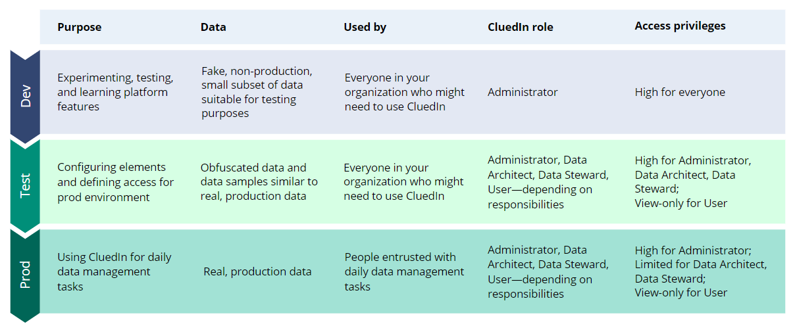
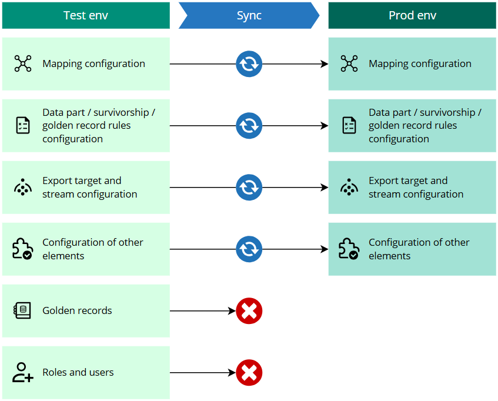

## On this page
{: .no_toc .text-delta }
- TOC
{:toc}

This article covers best practices for using development, test, and production environments of CluedIn. Here, you will learn how to make the most of your development and test environments to make sure your production environment is properly configured.

The following diagram explains the purpose, data, users, and access privileges for each environment. 
 

## Types of users

Before dwelling into the details of each environment, it is important to mention the main types of users in CluedIn and understand their areas of responsibility. Generally, there are 4 main types of users:

- Admin – this user is responsible for overall platform configuration as well as user and access management.
- Data architect – this user is responsible for setting up the overall data strategy, creating mapping, and configuring various data management elements (rules, glossary, streams, enrichers).
- Data steward – this user is responsible for conducting data cleaning and data management activities.
- View-only user – this user can view the elements in CluedIn, but cannot make any changes.

You can implement these types of users with the help of [roles](/administration/roles). The reason why we mention these types of users is that they have different privileges in each environment.

## Development environment

The primary purpose of development environment is to provide a **sandbox** for experimentation, testing, and learning of CluedIn features. This is why development environment should be **accessible to everyone** in your organization who wants to use CluedIn. What is more, it is recommended that all users get **high privileges** without any restrictions to be able to fully explore the platform features.

Due to the sandbox nature of the development environment, it is recommended to use fake, **non-production data**. This allows you to grant high privileges to all users without needing to restrict access to sensitive data. Essentially, development environment is a place for you to learn and make mistakes without affecting production data and configuration.

After you get acquainted with CluedIn and define your use cases and data objectives, you can move to the test environment and start configuring the elements according to your business needs.

{:.important}
It is not recommended to sync development and test environments. Your development environment should always run the latest version of CluedIn so that the users can explore all of the new features.

## Test environment

Test environment is a place where you carry out the **preparation** for production environment. At this point, you already know your use cases and data, so you can start creating and configuring mapping, rules, streams, enrichers, glossary terms, roles, permissions, and other elements. It is recommended to keep this environment **open for everyone** in your organization to allow for collaboration. However, consider **limiting privileges** for view-only users to restrict their ability to create and modify elements in CluedIn. This approach helps mirror the access controls you would have in the production environment.

For data in the test environment, we recommend using **obfuscated data** or data samples similar to production data, but not the production data itself. The reason for this is the same as in the development environment—to ensure flexibility and learning possibilities for all users.

{:.important}
If you want to use sensitive data while preparing the configuration for the production environment, you might need a dedicated pre-production environment. If this is your case, reach out to CluedIn support at support@cluedin.com.

After you configure all the elements you need for your data management tasks, you can move the configuration from the test environment to the production environment. You can sync test and production environments using CluedIn Production Toolkit available [here](/kb/config-migrate).

## Production environment

After you sync test and production environments, make sure you **assign the appropriate permissions** to the users entrusted with daily data management tasks. Since you have configured all of the needed elements in the test environment, very often there is no need to modify them in the production environment. This means that you can limit privileges for all users, except admin.

Essentially, as you move through the environments, you start with high privileges in development and move to very limited privileges in production.