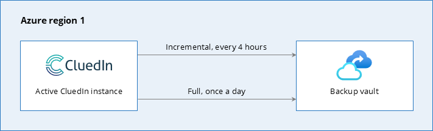
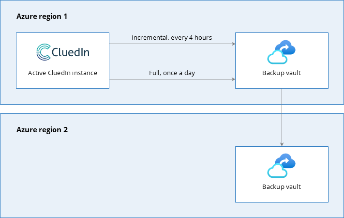
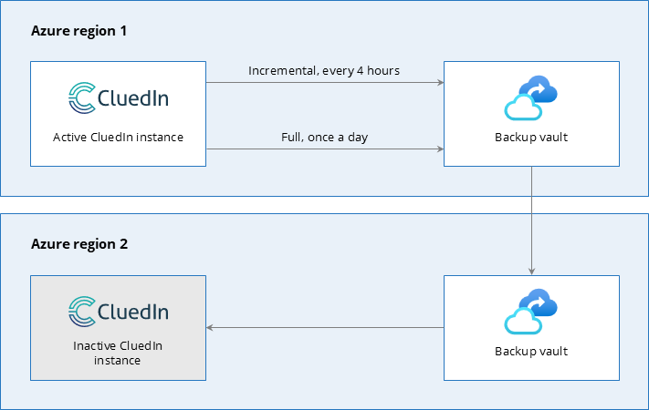
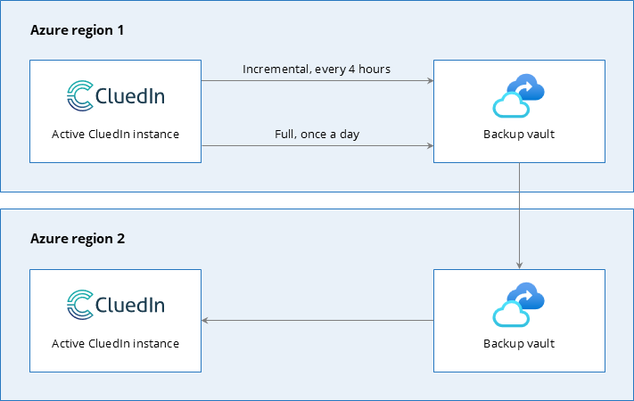

## On this page
{: .no_toc .text-delta }
- TOC
{:toc}

This article provides a high-level overview of the available disaster recovery options for the CluedIn PaaS instance. The purpose of this article is to help you understand the available disaster recovery options so you can choose the one that best meets your needs.

Depending on your agreement with CluedIn and your IT policy, the disaster recovery option that you choose can be managed either by CluedIn or by yourself. If you need to customize the selected option, additional costs may occur on the services side. In case of any questions, contact our support team at <a href="mailto:support@cluedin.com">support@cluedin.com</a>.

To begin with, it is important to emphasize that each CluedIn PaaS instance is **fully isolated**, both in terms of clusters and networks. This means that each instance operates within its own dedicated Azure Kubernetes Service (AKS) cluster located in the specific Azure region.

Keep in mind that your CluedIn cluster is set up with **high availability (HA)** by default, ensuring it remains operational even if some components fail. This means that critical pods are replicated—if one pod fails, the other one is ready to take over. These critical pods include `cluedin-server-processing`, `cluedin-datasource-processing`, `cluedin-gql`, `cluedin-server`, and `cluedin-ui`. So, you don't need to implement high availability on top of the cluster.

CluedIn PaaS uses the **standard tier** for AKS cluster management. This means that AKS cluster is guaranteed to be operational and available more than 99% of time. For more information about uptime SLA for AKS cluster management, see [Microsoft documentation](https://learn.microsoft.com/en-us/azure/aks/free-standard-pricing-tiers).

## Default backup

The default backup is a disaster recovery strategy where your CluedIn instance and backup vault are running in the same Azure region.

In the default backup scenario, we take **incremental snapshots** of your CluedIn instance **every 4 hours**. These snapshots are stored in a backup vault within the same Azure region. Additionally, we take a **full snapshot** of your CluedIn instance **once a day**, at night.

**Pros:**

- Cost efficiency – you pay only for one CluedIn instance and a backup vault in the Azure region of your choice.

**Cons:**

- No geo-redundancy – you won't be able to use CluedIn or access the backup during a regional outage or other disaster.
- No live switch-over – you won't be able to use CluedIn or access the backup during a regional outage or other disaster.

**Recovery time:** approximately **4 hours**, depending on Azure quotas in the region of your CluedIn installation. This is the estimated time to have a fully operational CluedIn instance with the latest backup.

## Geo-redundant backup

The geo-redundant backup is a disaster recovery strategy where your CluedIn instance and a backup vault are running in the primary Azure region, and an additional backup vault is running in the secondary Azure region.

In this scenario, you get access to the backup vault in the secondary Azure region, unlike the default backup scenario. With access to this backup, you can restore it in a different Azure region.

**Pros:**

- Cost efficiency – you pay only for one CluedIn instance and a backup vault in the primary Azure region and for a backup vault in the secondary region.
- Geo-redundant backup – you are protected against outages that affect backup vault in the primary region.

**Cons:**

- No live failover – you will need to set up a new CluedIn instance in a different Azure region.

**Recovery time:** approximately **4 hours**, depending on Azure quotas in the region of your CluedIn installation. This is the estimated time to have a fully operational CluedIn instance with the latest backup. However, generally, AKS is back online even before the backup is restored.

## Geo-redundant backup with cold switch-over

The geo-redundant backup with cold switch-over is a disaster recovery strategy where your CluedIn instance and a backup vault are running in the primary Azure region, and an additional backup vault and inactive CluedIn instance are running in the secondary Azure region.

In this scenario, your CluedIn instance in the secondary Azure region is configured but remains inactive. If your CluedIn instance in the primary Azure region fails, then the instance in the secondary region will be activated using the backup vault in its own region.

**Pros:**

- Geo-redundant backup – you are protected against outages that affect backup vault in the primary region.
- Ready to switch over – you can switch over to another CluedIn instance in case of regional outage or other disaster in the primary Azure region.

**Cons:**

- No live failover – switching to the CluedIn instance in the secondary Azure region might take some time. 
- Increased cost – you will incur more expenses due to the need for an additional cluster.

**Recovery time:** approximately **1 hour**. This is the estimated time to have a fully operational CluedIn instance with the latest backup. You don't need to worry about Azure quotas since you already have the reserved machines, ready to take over as soon as something happens. However, generally, by the time the secondary CluedIn instance takes over, the primary CluedIn instance has already recovered.

## Geo-redundant backup with live switch-over

The geo-redundant backup with live switch-over is a disaster recovery strategy where your CluedIn instance and a backup vault are running in the primary Azure region, and an additional CluedIn instance and backup vault are running in the secondary Azure region.

In this scenario, if your CluedIn instance in the primary Azure region fails, then your CluedIn instance in the secondary Azure region will take over the operation within minutes.

**Pros:**

- Geo-redundant backup – you are protected against outages that affect backup vault in the primary region.
- Live switch over – you can switch over to another CluedIn instance immediately in case of regional outage or other disaster in the primary Azure region.

**Cons:**

- Increased cost and complexity – the price of infrastructure might be three times higher than in the default backup scenario due to some requirements on the database level.

**Recovery time:** approximately **5 minutes**. The instance with the latest backup becomes available immediately once activated. This is the estimated time to have a fully operational CluedIn instance with the latest backup. However, generally, by the time the secondary CluedIn instance takes over, the primary CluedIn instance has already recovered.