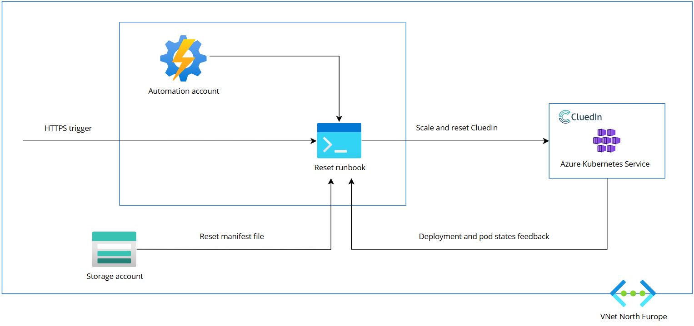
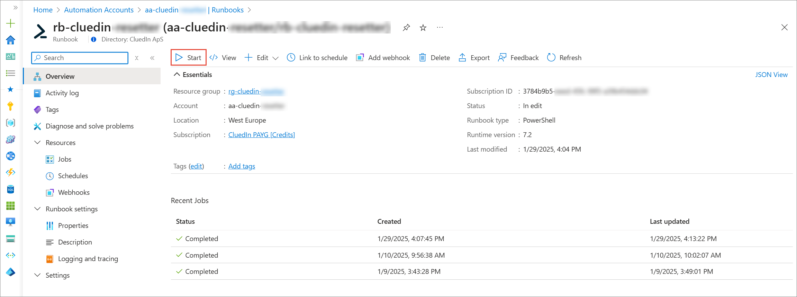
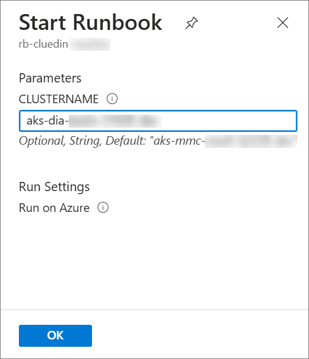
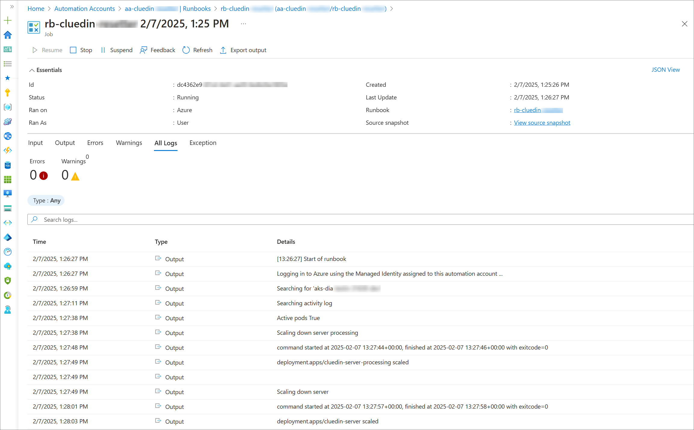
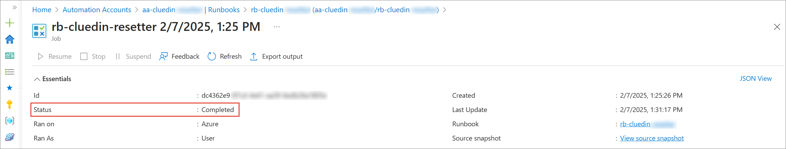

## On this page
{: .no_toc .text-delta }
- TOC
{:toc}

In this article, you will learn about the reset tool that you can use to restore your CluedIn cluster to its original installation state, retaining only the essential organization and user data.

You may want to reset your CluedIn instance if you’ve been using it for testing and have reached the desired result. Once you no longer need it for testing, you can reset it.

The reset tool **deletes all data and configurations** except for users, roles, organization, and the following organization-related tables:

- Agent
- Agent_AgentGroup
- AgentGroup
- OrganizationProfile
- UserProfile
- Provider
- PageTemplate
- EntityType
- DefaultPageTemplate
- PageTemplateEntityType
- LayoutTemplate
- NotificationTemplates
- Dimension
- Metric
- __MigrationHistory
- __RefactorLog

## Reset tool components

The reset tool is implemented as a console application that runs within a pod in your cluster, seamlessly integrating into your CI/CD pipeline. The main components of the reset tool are the following:

- Automation account
- Reset runbook
- Storage account
- Manifest file
- An instance of CluedIn

The automation account with the reset runbook and the storage account with the manifest file are **prepared for you by CluedIn**. The only thing you need to do is to [run the reset tool](#run-reset-tool).

{:.important}
If you would like to use the reset tool, reach out to CluedIn support at [support@cluedin.com](mailto:support@cluedin.com), and we will install and configure this tool in your environment.

The following diagram displays the configuration of the reset tool in your environment.

## Run reset tool

Once we set up the reset tool in your environment, you can reset your CluedIn instance any time you want.

**To reset your CluedIn instance**

1. In the Azure portal, find the automation account that contains the reset runbook, and then open the reset runbook.

1. At the top of the page, select **Start**.

    

1. Enter the name of the CluedIn cluster that you want to reset, and then select **OK**.

     

    It takes up to 30 minutes to reset your CluedIn instance. While the rest tool is running, you can view the detailed logs.

    

    Once the process is completed, your CluedIn instance will become available again.

    