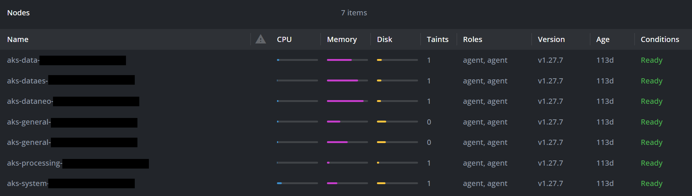

## On this page
{: .no_toc .text-delta }
- TOC
{:toc}

In this article, we address some of the most common questions related to CluedIn PaaS installation and configuration.

## Cluster overview

**How is the AKS cluster configured?**

CluedIn is shipped with a pre-defined configuration based on the selected [plan](/deployment/azure-marketplace/step-1#choose-a-plan). Since this configuration has been thoroughly tested for the number of records associated with each plan, auto-scaling in not enabled by default. However, CluedIn does support horizontal auto-scaling. So, if you need more power to process faster, we can enable this. If you have any questions about cluster sizing, we recommend discussing them with one of our cloud architects. They can provide better advice and help you avoid unnecessary costs.

**How many pods and containers are deployed for CluedIn?**

The number of pods depends on the size of your instance and whether auto-scaling is enabled. A typical production instance runs around 100 pods.

CluedIn is composed by 5 main containers:

- UI
- GQL
- Data Source
- Data Source Processing
- Submitter
- Server

The server can operate across multiple modes. For example, it can be setup to be a Web API, a processing box, or a streaming box. By default, your configuration will have 2 pods running as a Web API and 2 pods running as a processing box. Generally, this configuration is sufficient for 90% of the use cases we face. The following screenshot shows an example of nodes running in production.

**What are the key workloads running in CluedIn?**

The main workload in CluedIn is the server processing that requires large number of CPU and memory.

## Security

**Is RBAC enabled, and how is access to the cluster managed?**

By default, RBAC is not configured. However, Just-In-Time access or RBAC can be implemented if requested before the installation process. This needs to be discussed with our Operations team.

We have been installing CluedIn in a variety of setups, so customizing access to the cluster is something we do regularly. However, this needs to be done with caution, as less access can lead to less managed instance.

**Are containers running with least privilege?**

Yes, the containers are running with the non-root user privilege.

**How are secrets and sensitive data managed?**

Secrets and sensitive data are managed using Azure Key Vault integration, which ensures secure storage and access control.

## Pod and container management

**Are resource requests and limits (CPU/memory) configured for pods?**

Yes, the CPU and memory of the pods are limited by our Helm charts to ensure a pod does not exceed its allocated resources. However, please do not modify these values without consulting us first, as they are critical for the stable operation of the cluster.

**Are the containers sourced from a trusted registry and scanned for vulnerabilities?**

We have a non-public ACR registry that you will have access to, and we use Blackduck to scan all our containers on a release-by-release basis.

## Networking

**Are network policies in place to control pod-to-pod communication?**

CluedIn does not provide any policy for pod-to-pod communication out of the box. However, we have applied HTTPS communications between services for some customers. We do not advise setting this up, as the cluster should run within its own network, meaning that traffic from one pod to another would not be accessible outside the cluster.