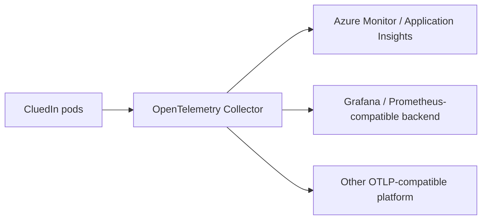

## On this page
{: .no_toc .text-delta }
- TOC
{:toc}

CluedIn can export telemetry using OpenTelemetry. This lets you send traces, metrics, and logs from CluedIn to an OpenTelemetry-compatible collector or observability platform.

## What CluedIn can export

OpenTelemetry support can export any combination of:

- traces
- metrics
- logs

CluedIn can also enable built-in instrumentation for:

- `HttpClient`
- `SqlClient`

This makes it possible to trace outbound HTTP calls and SQL activity without adding custom instrumentation to each call site.

## Configuration model

CluedIn follows standard OpenTelemetry environment-variable conventions wherever possible. For example, use `OTEL_SERVICE_NAME` to identify the service in your observability platform.

The exact endpoint, protocol, authentication, and signal configuration depend on the collector or platform that receives the telemetry.

A typical configuration includes:

```yaml
env:
  OTEL_SERVICE_NAME: cluedin
  OTEL_EXPORTER_OTLP_ENDPOINT: https://<collector-host>:4317
```

{:.note}
Use the protocol and port required by your collector. OTLP over gRPC commonly uses port 4317, while OTLP over HTTP commonly uses port 4318.

## Choose which signals to export

Enable only the signals you need. For example:

- **Traces** are useful for following requests across services and identifying latency.
- **Metrics** are useful for dashboards, capacity monitoring, and alerting.
- **Logs** are useful for centralized operational analysis and correlation with traces.

If your observability platform supports correlation across signals, use a consistent service name and resource metadata.

## Auto-instrument HTTP and SQL calls

CluedIn can optionally enable OpenTelemetry auto-instrumentation for `HttpClient` and `SqlClient`.

Use this when you want visibility into:

- outbound HTTP dependencies
- request latency to external services
- SQL query timing
- dependency failures

Be aware that dependency instrumentation can increase telemetry volume. Configure sampling and retention in your OpenTelemetry collector or destination platform as appropriate.

## Recommended architecture

A common production pattern is:



Using a collector between CluedIn and the final destination gives you a central place to configure batching, filtering, sampling, retries, and authentication.

## Verify telemetry

After enabling OpenTelemetry:

1. Restart the affected CluedIn pods so the environment variables are applied.
1. Run a normal operation such as opening the UI, processing data, or executing a rule.
1. Open the destination observability platform.
1. Confirm that the expected CluedIn service name appears.
1. Verify that the enabled signals are arriving.

If telemetry does not appear, check:

- the collector endpoint and protocol
- DNS and firewall access from the CluedIn cluster
- authentication headers or certificates required by the destination
- the OpenTelemetry collector logs
- the CluedIn pod environment variables

## OpenTelemetry and existing logging

OpenTelemetry does not require you to stop using existing CluedIn logging targets. You can continue using console, Seq, or Application Insights logging while introducing OpenTelemetry for distributed traces, metrics, or unified telemetry export.

For existing logging configuration, see [Logging](/deployment/infra-how-tos/configure-logging).
