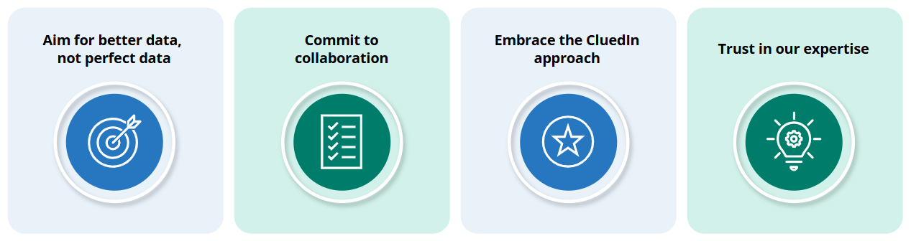
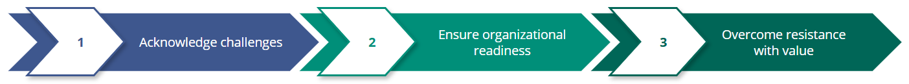

## On this page
{: .no_toc .text-delta }
- TOC
{:toc}

| Audience | Time to read |
|--|--|
| Business User, Data Project Lead | 3 min |

Before you start implementing your CluedIn project, take a moment to read this page and get to know us better. We believe that understanding our guiding principles and our approach to modern MDM will help you achieve outstanding results.

## Guiding principles

**Aim for better data, not perfect data.** At CluedIn, our mission is to enhance the quality of your data. We promise to support you throughout your journey, and we ask that you trust our expertise in handling Master Data Management (MDM) projects that involve multiple sources and millions of records.

**Commit to collaboration.** We understand that you have an in-depth knowledge of your data, but running CluedIn projects is our specialty, it is something we do all day, every day. This expertise allows us to provide you with the best possible support and guidance.

**Embrace the CluedIn approach.** We recommend resetting your preconceptions about MDM and embracing the CluedIn methodology. While there may be a learning curve initially, once you get the hang of it, we are confident you will find the experience rewarding and beneficial.

**Trust in our experience.** Trust our experience and let us guide you through the process. Our platform is designed to make your data management more efficient, agile, and scalable. Let's work together to achieve your data management goals, ensuring better data quality and more effective use of your resources.

## Our take on MDM

We recommend a three-step approach to MDM.

**1. Acknowledge challenges.** MDM is complex. Ingesting data from 20 sources and handling 20 million records is no easy task. If it were, your data would already be in perfect shape.

**2. Ensure organizational readiness.** MDM is not just about having the right tools; it is also about how prepared your organization is to embrace change and prioritize data quality in decision-making. By reading these lines, it's clear you already value data quality. However, we must also acknowledge that resistance is inevitable. Challenging the status quo is always hard, but you made the right choice by picking CluedIn, and we have strategies to overcome this resistance.

**3. Overcome resistance with value.** Resistance can come from various quarters—departments unwilling or unable to share data, technical challenges, firewalls, security, and permissions issues. These obstacles are normal, and we are experienced in dealing with them. The key to turning detractors into supporters lies in demonstrating value.

## Benefits of upgrading

We always recommend using the latest version of CluedIn. By upgrading to the latest version, you get maximum value at minimal risk. Here are the benefits of upgrading:

- **New features** – access the latest tools and functionalities designed to make your data management more effective.

- **Improved performance** – experience faster processing, better efficiency, and enhanced stability.

- **Enhanced user experience** – enjoy a more intuitive and user-friendly interface.

We understand that upgrades can be daunting, and we want to reassure you that we're here to help if anything goes wrong. In that case, we offer:

- **Rollback options** – we can always roll back to a previous version.

- **Backups** – we maintain comprehensive backups to ensure your data is safe and can be restored when needed.