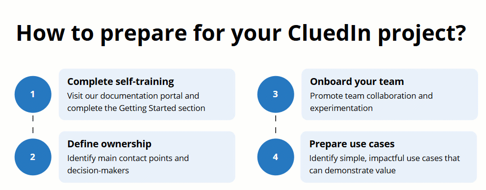
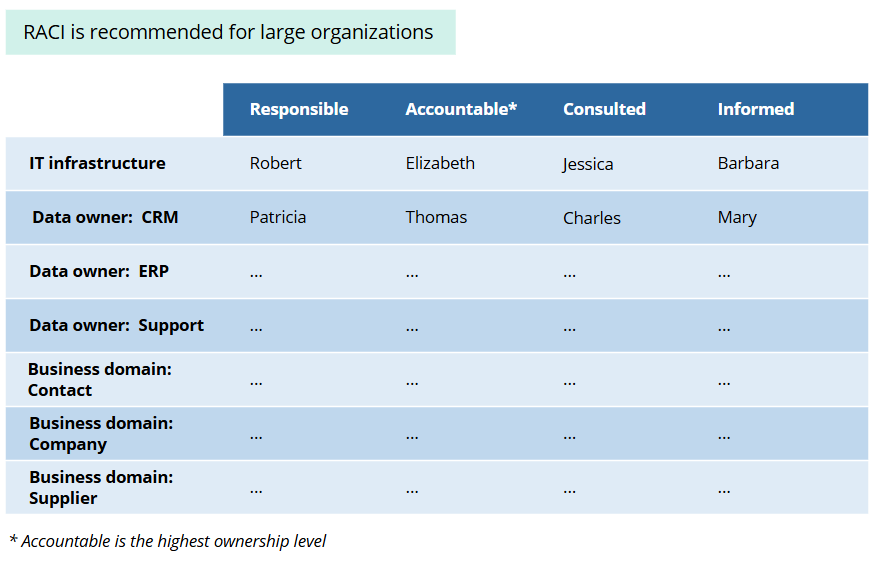
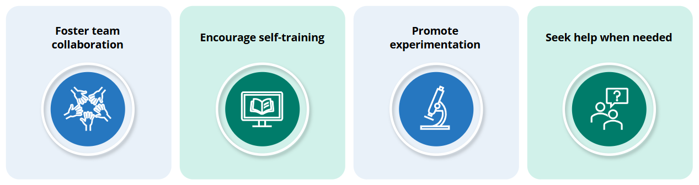

## On this page
{: .no_toc .text-delta }
- TOC
{:toc}

This article outlines four key steps to prepare for the implementation of you project in CluedIn. Following these steps will ensure that you and your team are ready to proceed with confidence.

## Complete self-training

Visit our documentation portal and complete the [Getting Started](/getting-started) section. This will provide a solid foundation and help you understand how CluedIn differs from traditional MDM platforms. Be open to new methodologies and concepts presented in the training materials. This shift in mindset is crucial for leveraging CluedIn's full potential.

## Define ownership

Establish a clear picture of **who owns what**. During the course of your CluedIn project, numerous small decisions will need to be made. Knowing who can make decisions at any moment is crucial. This clarity helps CluedIn provide timely support when needed.

The key ownership areas include:

- **IT Infrastructure** – assign someone to be responsible for the IT infrastructure. This person will address challenges and act as the primary contact for all IT-related requests.

- **Business domain** – identify owners or stakeholders for each business domain. These individuals will decide on the rules, needs, and value for their respective domains.

- **Data ownership** – each data source should have a designated owner. This can be someone internal or external to your team. For example, if you are using data from your CRM system, ensure someone owns that data.

Depending on the size of your organization, there are 2 approaches for defining ownership:

- **Small organization** – it is enough to define the **Accountable** person for each key ownership area.

- **Large organization** – build a **RACI matrix** (Responsible, Accountable, Consulted, Informed) for each key ownership area and clearly communicate the involvement required from these owners. Even if they won’t be using CluedIn directly, effective data management depends on their active participation.

When you add a new source or a new business domain, go back to the RACI matrix and update it accordingly. The RACI matrix should probably be in the first page of your internal wiki, SharePoint, or Confluence site.

## Onboard your team

This section offers guidelines to onboard your team for the CluedIn implementation journey. By following these guidelines, your team will be well-equipped to overcome challenges and achieve your data management goals.

To prepare your team to embark on the CluedIn implementation journey, follow these steps:

- **Foster team collaboration** – emphasize the importance of teamwork. Project implementation is a journey with ups and downs, and success depends on collective effort and support.

- **Encourage self-training** – allow team members to experiment and self-train. This hands-on experience is vital for learning and overcoming initial discomfort.

- **Promote experimentation** – foster a culture of experimentation where it’s acceptable to make mistakes and learn from them. Think of implementing CluedIn like learning to ride a bike. The first time you try, it's likely you'll fall a few times. Just like you needed practice, support, and maybe some help from your parents when learning to ride a bike, your team will need to go through a similar process.

    At first, it might feel uncomfortable, and you might need guidance from CluedIn experts. However, with persistence, you'll gradually become more comfortable and eventually, you'll be able to ride smoothly on your own. This journey of trial, error, and gradual improvement will ultimately lead to mastery.

- **Seek help when needed** – don’t hesitate to reach out for support if the team encounters roadblocks. CluedIn support is available to assist, but the primary focus should be on self-discovery and problem-solving. Additionally, you can book an enablement training with us by reaching out to our [sales team](https://www.cluedin.com/discovery-call).

## Prepare use cases

If you read our article on [how to approach a data project in CluedIn](/playbooks/how-to-approach-your-cluedin-project), you already know the importance of starting small. Here are additional recommendations for preparing your first use cases:

- **Priority 1: Few Records** – select use cases that involve a small number of records.

- **Priority 2: Easy** – choose something straightforward to implement.

- **Priority 3: Impact** – ensure the use case creates noticeable value.

Your initial use cases do not have to be the highest priority tasks but should be significant enough to demonstrate value. Successfully implementing these small use cases will help your team build confidence in your approach, processes, and tools. Use these early successes to demonstrate your team’s ability to deliver results and highlight CluedIn’s effectiveness to stakeholders.

Once that is done, scale up gradually, and begin tackling your more substantial, real-world use cases. You can ingest millions of records into CluedIn, so you don't have to worry about the load. Instead, think about business domains, rules, and what you want to produce. After that, the next natural step might involve processing all records or integrating one more source.

This process will help you find **balance between time and value**. Aim to clean, deduplicate, enrich, and process smaller subsets of data thoroughly rather than handling massive datasets with minimal processing.

Embrace a pragmatic approach by adapting to reality. Understand that sometimes compromises are necessary. You might not be able to enrich or deduplicate all data immediately, and that's acceptable. CluedIn's experience and support will help you find this balance to implement a successful project.