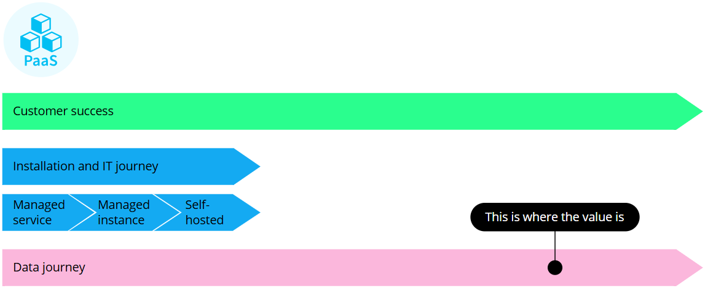
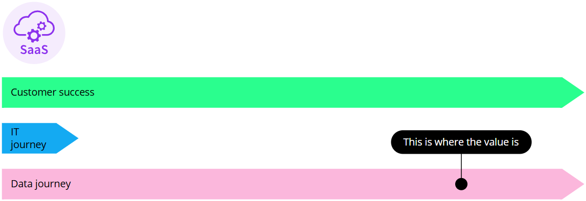
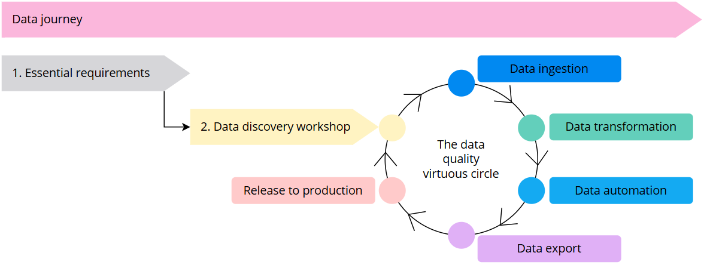

## On this page
{: .no_toc .text-delta }
- TOC
{:toc}

This article outlines the main steps for starting your CluedIn project. Adopting the approach that we describe here will help you implement your project in an efficient manner.

To streamline the process of starting your CluedIn project and provide a clear framework, we suggest dividing the project into 2 aspects:

- **IT journey** – involves CluedIn installation and other IT tasks for connecting CluedIn to external data sources and systems.

- **Data journey** – involves data discovery followed by data ingestion, transformation, automation, export, and release to production.

Depending on the cloud service offering that you choose—PaaS or SaaS—your IT journey will be different, but your data journey will be the same. Below, we'll look at each aspect in more detail.

## PaaS CluedIn journey

With CluedIn PaaS (platform as a service), you can install and manage CluedIn in your own Azure IT infrastructure, thus ensuring that your data stays in your own environment. We'll work as **part of your team** throughout the whole PaaS CluedIn journey to ensure customer success.

For more details about PaaS installation and IT journey, see [Start your IT journey](/playbooks/start-your-it-journey).

## SaaS CluedIn journey

With CluedIn SaaS (software as a service), you can use CluedIn on a subscription basis. Instead of installing CluedIn in your own Azure IT infrastructure, you can access it in an isolated environment through a web browser. We'll work as **part of your team** throughout the whole SaaS CluedIn journey to ensure customer success.

For more details about SaaS IT journey, see [Start your IT journey](/playbooks/start-your-it-journey).

## Data journey

The data journey starts from the **essential requirements** workshop, where you discuss your objectives with a CluedIn expert so that we understand your use cases. The next step is the **data discovery** workshop, where you will collaborate with a CluedIn expert to discuss the data sources for your initial use case. Establishing and connecting to the data sources is the first step in the **data quality virtuous cycle**.

The data quality virtuous cycle is a concept that emphasizes the continuous improvement of data quality through an iterative process of:

- **Data ingestion** – upload the data from the source systems into CluedIn and then map and process it to produce golden records.

- **Data transformation** – identify and correct any issues in your data with the help of clean projects, establish criteria for finding and eliminating duplicates.

- **Data automation** – create business rules to apply data transformations, capture data quality issues, and determine operational values.

- **Data export** – send ready-to-use data from CluedIn to the external systems (also known as _landing zones_) where you usually perform tasks with business data.

- **Release to production** – when all of the above steps are working as intended, release your first use case to production, and start with the next one.