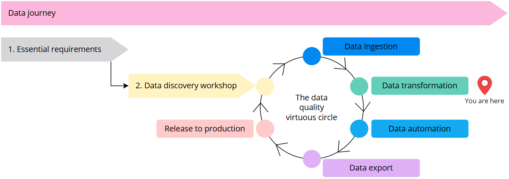
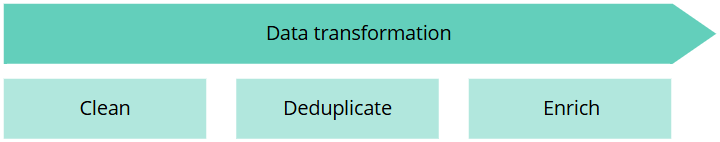
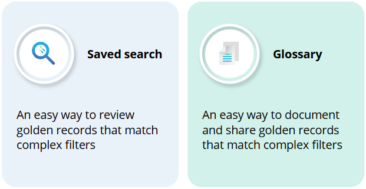

| Audience | Time to read |
|--|--|
| Data Steward | 4 minutes |

**You are here in the data journey**

Now that you have completed the [data ingestion](/playbooks/data-ingestion-playbook) process and generated some [golden records](/key-terms-and-features/golden-records), it is time to start improving the quality of these records during data transformation.

The data transformation process consists of three aspects:

- Improving the quality of values with the help of clean projects.

- Decreasing the number of duplicates with the help of deduplication projects.

- Extending the quality with values coming from trusted sources with the help of enrichers.

The **sequence of data transformation activities is flexible**. You can start with data cleaning, then move to deduplication, and finally to enrichment. Alternatively, you can start with deduplication, then clean the data, and add enrichers last. The choice is yours as CluedIn doesn't impose a strict order of data transformation activities.

In this playbook, we will provide the details for each data transformation aspect. However, before diving into specifics, familiarize yourself with the key terms and features that will be useful during data transformation in CluedIn:

- [Golden record](/key-terms-and-features/golden-records)

- [Saved search](/key-terms-and-features/search#saved-searches)

- [Glossary term](/getting-started/glossary)

For a smooth start of your data transformation journey in CluedIn, learn how to leverage saved search and glossary. Both of these tools help you identify a specific set of golden records for data transformation. However, each tool has its specific practical application.

**Why is saved search important for data transformation?**

Saved search gives you an easy way to **review golden records** that match complex filters. Once you define the filters and add the needed vocabulary keys to the search page, you can save the current search configuration for future use. Next time when you need to review a specific set of golden records and their vocabulary keys, you can quickly open a saved search instead of configuring the search from scratch. That's why saved search is a great tool for your **day-to-day data transformation activities**.

Saved search can be personal (visible only for you) or shared (visible to your team members). If you want others to review a specific set of golden records, make sure you create a shared saved search.

In addition to reviewing golden records, saved search is useful for creating clean projects. When you make a decision on which golden records you want to clean, you can register this decision in a saved search. This way you can quickly **create a clean project** and **verify the results** of your cleaning activities.

Let's consider an example of golden records that contain misspelled job titles. When configuring the search filters, you can list all misspelled values for the Job Title property. As a result, you will see all golden records that contain misspelled job titles. To be able to **identify data quality issues at a glance**, you can customize the search results page by adding or removing the columns (properties or vocabulary keys). When you reach the desired view of golden records on the search results page, it is time to save the current search configuration. After you retrieve the saved search, you can **create a clean project in just a few clicks**—the properties will be taken directly from the saved search. Another advantage is that you can quickly verify the results of your cleaning activities—simply open the saved search and if there are no results, it means that all data quality issues have been fixed.

**Why is glossary important for data transformation?**

While glossary is similar to the saved search in terms of reviewing golden records that match complex filters, it gives you an additional advantage of **documenting your golden records**. It means that you can add descriptions, tags, ratings, and certification levels to the glossary term. All of these elements make it easier for your colleagues to understand:

- What golden records are included in the glossary term.
- What you are trying to achieve with a specific collection of golden records.
- What data transformation activities you have performed on a specific collection of golden records.

Glossary can be used in filters in several places in CluedIn: search, clean projects, deduplication projects, and streams. Essentially, you can create a glossary with a specific set of golden records, then perform various data transformation activities on those golden records, and finally send ready-to-use and well-documented golden records to external systems. That's why glossary is especially useful in in **data-sharing activities**—you can set up a stream with a specific glossary to send well-documented golden records to external systems.

**Where to start with data transformation?**

Start by identifying a set of golden records that should be transformed. Register those golden records along with specific vocabulary keys using a saved search or glossary. As the order of data transformation activities is flexible, we suggest starting with clean projects.