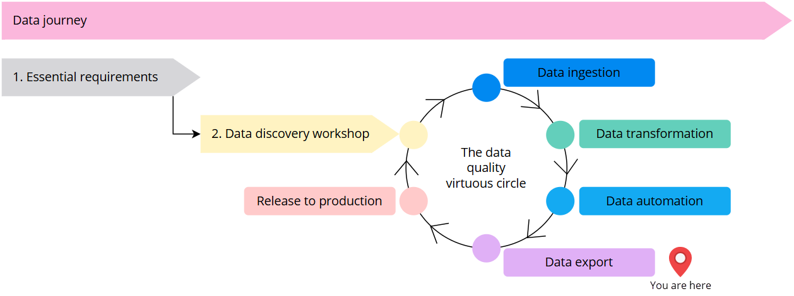
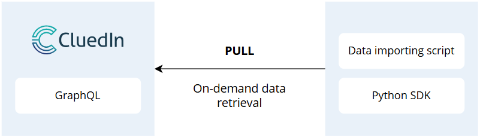
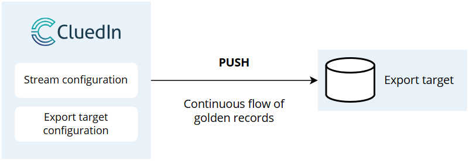
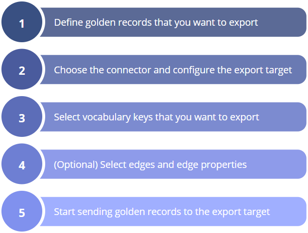

## On this page
{: .no_toc .text-delta }
- TOC
{:toc}

| Audience | Time to read |
|--|--|
| Data Engineer, Data Analyst | 4 min |

**You are here in the data journey**

**Before you start**

- Get acquainted with the overall [concept of a stream](/consume/streams/concept-of-a-stream) in CluedIn.

- Watch a [video](/consume) for a step-by-step explanation of how to export golden records in CluedIn.

Now that you have completed the [data transformation](/playbooks/data-transformation-playbook) process and reached the desired quality of your [golden records](/key-terms-and-features/golden-records), it is time to **push golden records to the target systems** in your organization.

{:.important}
To establish correlations between exported golden records in your target systems, use the [entity origin code (primary identifier)](/key-terms-and-features/entity-codes#entity-origin-code-primary-identifier) and [codes (identifiers)](/key-terms-and-features/entity-codes#entity-codes-identifiers) instead of the entity ID. This is because the entity ID does not guarantee uniqueness, as records with different IDs could be merged.

## Data export models

CluedIn supports two data export models:

- **Pull model** – in this model, the target system pulls data from the source system (CluedIn) when needed. You have the option to use your own code or script to get golden records from CluedIn, or you can pull the data directly using GraphQL API.

    

- **Push model** – in this model, the source system (CluedIn) actively sends data to the target system. You can use CluedIn connectors and configure streams to push golden records to the target system. So, the goal of streaming in MDM is to push golden records to the target system. For more information, see [Streams](/consume/streams).

    

The following table outlines the pros and cons of each data export model.

| Data export model | Pros | Cons |
|--|--|--|
| Pull model | - You have greater control over the load on source and target systems by deciding when to pull data (lazy loading). - You can manipulate records using tools like Microsoft Fabric. - You can export all golden record properties, as opposed to streams, where the set of properties is hardcoded. | You need to maintain the code and handle timeouts, retries, and any errors that may occur in your script. |
| Push model | - You can work in the CluedIn UI without the need for code or scripts. - CluedIn manages retries, timeouts, and issues, and reports them to you. | This model is more specific about the export format (golden record properties and vocabulary keys, with or without edges). |

**When to use the pull model (CluedIn's GraphQL API)**

- When you have a small number of records and many Fabric users.

- When you need to perform additional manipulations on the records or require a custom format before exporting.

- When you have complex queries involving different business domains related to each other.

The pull model is a good choice for use cases involving on-demand data queries, ad-hoc reporting, and integration with systems requiring real-time data access. This model allows for on-demand import from CluedIn using data pipelines, notebooks, or similar tools ([GraphQL](/consume/graphql), [Python SDK](https://pypi.org/search/?q=cluedin)).

**When to use the push model (CluedIn stream)**

- When you have a large number of records and deltas.

- When you need to export golden records.

- When no one on the project can write code.

The push model is a good choice for use cases involving event-triggered updates and systems requiring regular, predictable data ingestion. This model allows for real-time export from CluedIn or export to a passive storage that can’t pull data.

## Configuring a stream

If you decide to implement the push data export model for your use case, then you'll need to configure a stream. The process of configuring a stream consists of five steps as shown on the following diagram.

Note that **exporting edges** is an optional step. Edges represent relations between golden records. If your golden records contain edges, you can export them to be able to correctly link related golden records in the target system.

You can find detailed instructions for each step in the process in our article about [creating a stream](/consume/streams/create-a-stream). 

## Connector reference

If the push model is a suitable choice for you, get acquainted with the connectors supported in CluedIn. This section provides brief descriptions of each connector and links to configuration instructions.

| Connector | Description |
|--|--|
| [Azure Data Lake connector](/consume/export-targets/adl-connector) | Azure Data Lake ensures real-time access to trusted, high-quality golden records. Leveraging its massive scalability, secure storage, and advanced analytics capabilities, Azure Data Lake can efficiently process and analyze golden records for deeper insights and smarter decision-making. |
| [Azure Dedicated SQL Pool connector](/consume/export-targets/azure-dedicated-sql-pool-connector) | Use this connector when you need to integrate large volumes of structured data from your golden records into a high-performance, scalable data warehouse for advanced analytics, reporting, and business intelligence. However, this connector is not a good choice for frequent data pushes. |
| [Azure Event Hub connector](/consume/export-targets/azure-event-hub-connector) | Azure Event Hub enables real-time streaming of trusted golden records from CluedIn. It provides scalable, low-latency data distribution for seamless integration with downstream systems and analytics platforms.|
| [Azure Service Bus connector](/consume/export-targets/azure-service-bus-connector) | Azure Service Bus provides a reliable, scalable messaging platform for integrating golden records. It enables seamless communication and data exchange between systems and applications through asynchronous messaging. |
| [Dataverse connector](/consume/export-targets/dataverse-connector) | Microsoft Dataverse enables the integration of trusted golden records from CluedIn and provides a secure, scalable, and unified data platform for business applications, automation, and analytics. |
| [Http connector](/consume/export-targets/http-connector) | This connector enables seamless integration with any third-party service or system that supports HTTP calls. It is a versatile tool that provides flexibility and ease of connectivity. |
| [OneLake connector](/consume/export-targets/onelake-connector) | This connector enables seamless integration of trusted golden records from CluedIn into Microsoft OneLake that provides unified storage, scalability, and easy access for analytics and AI workloads across the Microsoft Fabric ecosystem. |
| [SQL Server connector](/consume/export-targets/sql-server-connector) | This connector offers a standardized and reliable way for sharing golden records. SQL Server ensures consistent, structured data that can be easily accessed and integrated by multiple downstream systems. |