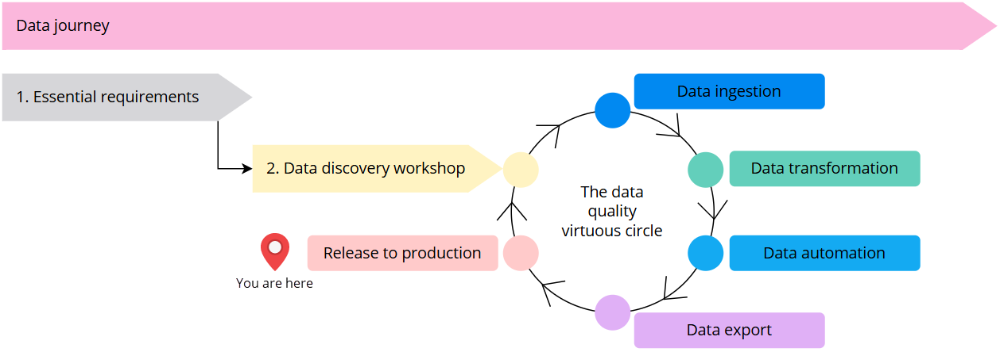
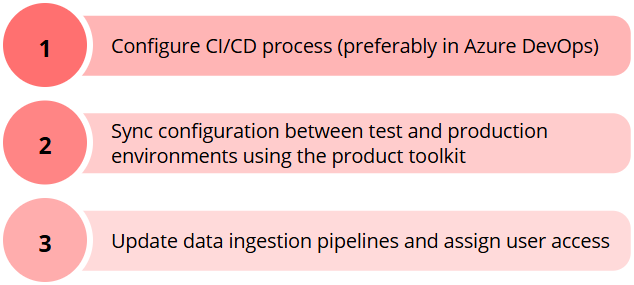

## On this page
{: .no_toc .text-delta }
- TOC
{:toc}

| Audience | Time to read |
|--|--|
| Data Architect, Data Engineer | 2 min |

**You are here in the data journey**

Now that you have implemented your first use case in the test environment, it is time to release your solution to production. This process consists of three steps as shown on the following diagram.

## Set up CI/CD process

Continuous integration (CI) pipeline should be implemented if you develop specific packages, such as export targets, crawlers, and enrichers. Once the package is ready, it must be integrated into CluedIn. You need to automate the process to update the configuration of your CluedIn instance with the new package version. Finally, you need to call Helm update commands to make the package available and operational.

Continuous deployment (CD) pipeline should be implemented to automatically deploy new package versions or configuration changes.

You can configure your CI/CD pipelines and automate your processes using Azure DevOps. Since your CluedIn instance is installed on an AKS cluster, which is part of Microsoft’s infrastructure, **Azure DevOps is a good choice for implementing CI/CD**.

## Sync configuration between environments

You can sync the configuration of your CluedIn instance between environments with the help of our **product toolkit** available in [Sync configuration between environments](/kb/config-migrate).

Learn which elements of CluedIn configuration can and cannot be synced in [Environment management playbook](/kb/env-management-playbook).

{:.important}
Data, users, and roles cannot be migrated from one environment to another. This means that once you are in production, you need to ingest the data into your production instance and assign user access accordingly.

## Ingest production data

After syncing configuration from test to production environments, you need to **update your data ingestion pipelines** to point to your CluedIn production instance. If you are using ingestion endpoints, you can update the URL in data pipelines or copy the data pipelines and update the URL.

CluedIn can effectively process ingested data. Suppose you ingested 1 million records last week and are now ingesting data from the same source again. If you are using bridge mode, the ingestion and processing will be much faster because CluedIn will not store ingested data in the temporary storage on the **Preview** tab. The data will go directly into processing where it is checked for duplicates. If identical records are found, they will not be processed again.
