## On this page
{: .no_toc .text-delta }
- TOC
{:toc}

This page explains how to connect to the CluedIn REST API: base URLs, authentication, and the conventions that requests and responses follow. For the full list of endpoints, see the [API reference](/rest-api/api-reference).

## How the API is organized

The API has more than 1,000 endpoints, grouped into [categories](/rest-api/api-reference). Rather than listing them alphabetically, the tree below organizes those categories around the **problem each one solves**, following the path data takes through CluedIn—from getting it in, to mastering it, to delivering it back out, plus the categories that operate, secure, and automate the platform around that flow.

Use it to find the right starting point: identify the question you are trying to answer, then open the matching category in the [API reference](/rest-api/api-reference).

```mermaid
graph LR
  API["CluedIn REST API"]

  API --> OP["Operate the platform<br/>Keep CluedIn running"]
  API --> IN["Get data in<br/>Bring source data into CluedIn"]
  API --> MODEL["Model the data<br/>Give data shared meaning"]
  API --> MASTER["Build golden records<br/>Turn raw data into trusted records"]
  API --> FIND["Find & explore<br/>Make records discoverable"]
  API --> OUT["Deliver data out<br/>Send trusted data downstream"]
  API --> GOV["Govern & secure<br/>Control who does what"]
  API --> AUTO["Automate & augment<br/>Reduce manual effort"]

  OP --> admin["Administration & configuration<br/><i>How do I manage configuration, settings, and billing?</i>"]
  OP --> org["Organization<br/><i>How do I manage the org and its providers?</i>"]

  IN --> ingest["Data ingestion<br/><i>How do I load files, imports, and jobs?</i>"]

  MODEL --> vocab["Vocabularies<br/><i>How is my data typed and described?</i>"]
  MODEL --> gloss["Glossary<br/><i>What do our business terms mean?</i>"]
  MODEL --> hier["Hierarchies<br/><i>How is data organized into hierarchies?</i>"]

  MASTER --> ent["Entities<br/><i>What are my golden records?</i>"]
  MASTER --> rules["Rules & evaluation<br/><i>How are records transformed and merged?</i>"]
  MASTER --> prep["Data preparation & enrichment<br/><i>How do I clean and enrich records?</i>"]

  FIND --> search["Search<br/><i>How do I find records across the graph?</i>"]
  FIND --> ui["Insights & UI<br/><i>How do I surface activities and notifications?</i>"]

  OUT --> streams["Streams, connectors & export<br/><i>How do I push data to other systems?</i>"]

  GOV --> acl["Access control & governance<br/><i>Who can do what; GDPR and audit?</i>"]

  AUTO --> flow["Workflow & automation<br/><i>How do I automate tasks and approvals?</i>"]
  AUTO --> ai["AI<br/><i>How do I use AI agents, skills, and Copilot?</i>"]

  %% CluedIn brand styling: navy root, teal phases, white category cards
  classDef root fill:#0d2547,stroke:#19cca3,stroke-width:2px,color:#ffffff;
  classDef phase fill:#19cca3,stroke:#13a384,stroke-width:1px,color:#0d2547;
  classDef cat fill:#ffffff,stroke:#d1d6dc,stroke-width:1px,color:#0d2547;

  class API root;
  class OP,IN,MODEL,MASTER,FIND,OUT,GOV,AUTO phase;
  class admin,org,ingest,vocab,gloss,hier,ent,rules,prep,search,ui,streams,acl,flow,ai cat;

  %% Links to each category's API reference page
  click API href "/rest-api/api-reference" "All API reference categories" _self
  click admin href "/rest-api/api-reference/administration-and-configuration" "Administration & configuration reference" _self
  click org href "/rest-api/api-reference/organization" "Organization reference" _self
  click ingest href "/rest-api/api-reference/data-ingestion" "Data ingestion reference" _self
  click vocab href "/rest-api/api-reference/vocabularies" "Vocabularies reference" _self
  click gloss href "/rest-api/api-reference/glossary" "Glossary reference" _self
  click hier href "/rest-api/api-reference/hierarchies" "Hierarchies reference" _self
  click ent href "/rest-api/api-reference/entities" "Entities reference" _self
  click rules href "/rest-api/api-reference/rules-and-evaluation" "Rules & evaluation reference" _self
  click prep href "/rest-api/api-reference/data-preparation-and-enrichment" "Data preparation & enrichment reference" _self
  click search href "/rest-api/api-reference/search" "Search reference" _self
  click ui href "/rest-api/api-reference/insights-and-ui" "Insights & UI reference" _self
  click streams href "/rest-api/api-reference/streams-and-export" "Streams, connectors & export reference" _self
  click acl href "/rest-api/api-reference/access-control-and-governance" "Access control & governance reference" _self
  click flow href "/rest-api/api-reference/workflow-and-automation" "Workflow & automation reference" _self
  click ai href "/rest-api/api-reference/ai" "AI reference" _self
```



### What each category answers

The table maps every category to the question it answers and links to its reference page. The endpoint counts give a sense of how much surface each area covers.

| Phase | Category | The problem it answers | Endpoints |
|---|---|---|---|
| Operate the platform | [Administration & configuration](/rest-api/api-reference/administration-and-configuration) | How do I manage configuration, settings, logs, and metered billing? | 48 |
| Operate the platform | [Organization](/rest-api/api-reference/organization) | How do I manage the organization profile and its providers? | 37 |
| Get data in | [Data ingestion](/rest-api/api-reference/data-ingestion) | How do I bring data in via files, imports, integrations, and jobs? | 23 |
| Model the data | [Vocabularies](/rest-api/api-reference/vocabularies) | How is my data typed and described with vocabulary keys? | 110 |
| Model the data | [Glossary](/rest-api/api-reference/glossary) | What do our shared business terms mean? | 57 |
| Model the data | [Hierarchies](/rest-api/api-reference/hierarchies) | How is data organized into hierarchies and the global data model? | 30 |
| Build golden records | [Entities](/rest-api/api-reference/entities) | What are my golden records—how do I read, modify, merge, and split them? | 136 |
| Build golden records | [Rules & evaluation](/rest-api/api-reference/rules-and-evaluation) | How are records transformed, merged, and survived; what did a rule do? | 66 |
| Build golden records | [Data preparation & enrichment](/rest-api/api-reference/data-preparation-and-enrichment) | How do I clean and enrich records? | 42 |
| Find & explore | [Search](/rest-api/api-reference/search) | How do I find records across the graph and manage saved searches? | 51 |
| Find & explore | [Insights & UI](/rest-api/api-reference/insights-and-ui) | How do I surface activities, templates, and notifications? | 62 |
| Deliver data out | [Streams, connectors & export](/rest-api/api-reference/streams-and-export) | How do I push trusted data to downstream systems? | 63 |
| Govern & secure | [Access control & governance](/rest-api/api-reference/access-control-and-governance) | Who can do what; how do I handle GDPR and audit? | 37 |
| Automate & augment | [Workflow & automation](/rest-api/api-reference/workflow-and-automation) | How do I automate tasks, approvals, and flows? | 44 |
| Automate & augment | [AI](/rest-api/api-reference/ai) | How do I use AI agents, jobs, skills, and Copilot? | 113 |

## Base URL

The API is served from your CluedIn environment under the `/api` path:

```
https://<organization>.<domain>/api
```

Replace `<organization>.<domain>` with the host of your own CluedIn environment—for example, `https://acme.cluedin.com/api`.

All requests must use HTTPS.

## Versioning

Most endpoints are available both unversioned and with an explicit version prefix:

```
https://<organization>.<domain>/api/accesscontrolpolicies
https://<organization>.<domain>/api/v1/accesscontrolpolicies
```

A small number of endpoints offer additional versions (for example, `/api/v2/search/suggest` and `/api/v3/search/suggest`).

{:.important}
For stability, prefer the explicit versioned path (`/api/v1/...`). Each endpoint's exact path and available versions are shown in the [API reference](/rest-api/api-reference).

## Authentication

The API uses **bearer token** authentication. Every request must include an `Authorization` header with a valid CluedIn API token:

```
Authorization: Bearer <your-api-token>
```

Include the word `Bearer`, followed by a single space, before the token value.

You generate API tokens in the CluedIn UI under **Administration** > **API Tokens**. For step-by-step instructions, see [Generate an API token](/administration/api-token).

{:.important}
Treat API tokens as secrets. Store them in a secure location such as a password vault, never commit them to version control, and revoke them when they are no longer needed.

### Permissions

Many endpoints require specific permissions in addition to a valid token. The required policy is shown in each endpoint's summary in the API reference (for example, `Auth policies: RACI:management.accesscontrol`). Make sure the token has been granted the corresponding scope; otherwise the request is rejected with `403 Forbidden`.

## Request and response format

- Send request bodies as JSON with the `Content-Type: application/json` header.
- Set `Accept: application/json` to receive JSON responses.
- Responses are returned as JSON. Some endpoints also support `text/json` and `text/plain`.

| Header | Value | When to send |
|---|---|---|
| `Authorization` | `Bearer <your-api-token>` | Every request. |
| `Content-Type` | `application/json` | Requests that include a body (`POST`, `PUT`, `PATCH`). |
| `Accept` | `application/json` | Recommended on every request. |

## Collection parameters

Endpoints that return collections commonly support the following query parameters for paging and sorting. The exact parameters and filters available for a given endpoint are listed in the [API reference](/rest-api/api-reference).

| Parameter | Type | Description |
|---|---|---|
| `page` | integer | Zero-based page index. Defaults to `0`. |
| `take` | integer | Number of items to return per page. Defaults to `20`. |
| `orderBy` | string | Name of the field to sort by. |
| `orderAsc` | boolean | Sort direction. Defaults to `true` (ascending). |

## Status codes

The API uses standard HTTP status codes.

| Code | Meaning |
|---|---|
| `200 OK` | The request succeeded. |
| `201 Created` | The resource was created successfully. |
| `400 Bad Request` | The request was malformed or failed validation. |
| `401 Unauthorized` | The token is missing, invalid, or expired. |
| `403 Forbidden` | The token is valid but lacks the required permission. |
| `404 Not Found` | The requested resource does not exist. |
| `409 Conflict` | The request conflicts with the current state of the resource. |
| `500 Internal Server Error` | An unexpected error occurred on the server. |

## Examples

The examples below use `/api/v1` paths. Set the `CLUEDIN_API_TOKEN` environment variable to your token before running them.

### Check connectivity

`GET /api/v1/status` reports whether the environment is reachable.

```bash
curl "https://<organization>.<domain>/api/v1/status" \
  -H "Accept: application/json"
```

### Authenticated GET request

The following request retrieves vocabulary keys.

```bash
curl "https://<organization>.<domain>/api/v1/vocabs/keys" \
  -H "Authorization: Bearer $CLUEDIN_API_TOKEN" \
  -H "Accept: application/json"
```

The same request in PowerShell:

```powershell
$headers = @{
    Authorization = "Bearer $env:CLUEDIN_API_TOKEN"
    Accept        = "application/json"
}
Invoke-RestMethod -Uri "https://<organization>.<domain>/api/v1/vocabs/keys" -Headers $headers
```

### Request with a JSON body

`POST`, `PUT`, and `PATCH` requests send a JSON body and must include the `Content-Type` header.

```bash
curl -X POST "https://<organization>.<domain>/api/v1/<resource>" \
  -H "Authorization: Bearer $CLUEDIN_API_TOKEN" \
  -H "Content-Type: application/json" \
  -H "Accept: application/json" \
  -d '{ "name": "Example" }'
```

Refer to the [API reference](/rest-api/api-reference) for the exact request body schema of each endpoint.
