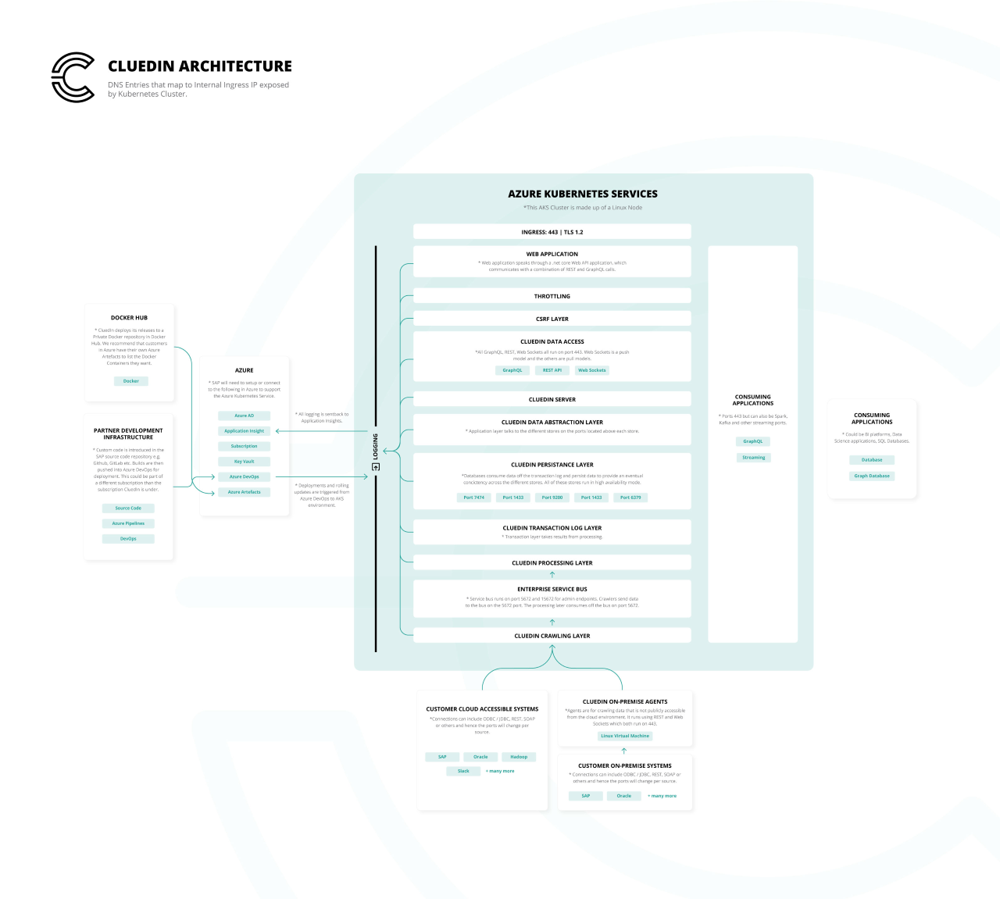

<iframe width="640" height="360" frameborder="0" allowfullscreen src="https://player.vimeo.com/video/312062542?controls=1"></iframe>

## CluedIn Quick Start

<iframe src='https://vimeo.com/showcase/10332033/embed' allowfullscreen frameborder='0' style='position:absolute;top:0;left:0;width:100%;height:100%;'></iframe>

## What is CluedIn

CluedIn is a Master Data Management platform that helps companies integrate, clean, govern and manage their most important company data.

The following diagram depicts the main components of the CluedIn application with a reference architecture on Microsoft Azure. You can also see a reference architecture directly on the [Microsoft](https://docs.microsoft.com/en-us/azure/architecture/reference-architectures/data/cluedin) website. 

On this site, you can find documentation and knowledge base articles about CluedIn. What are you up to read today?:


