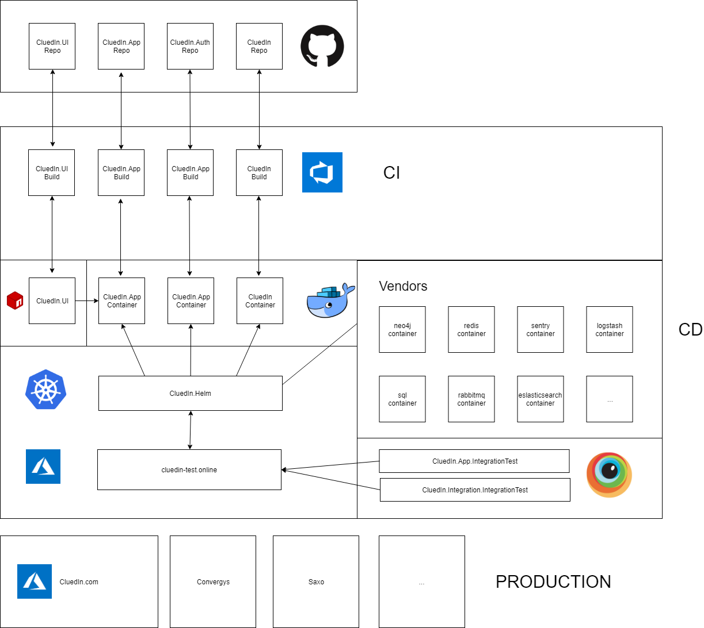
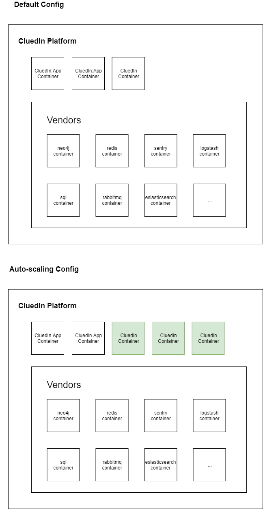
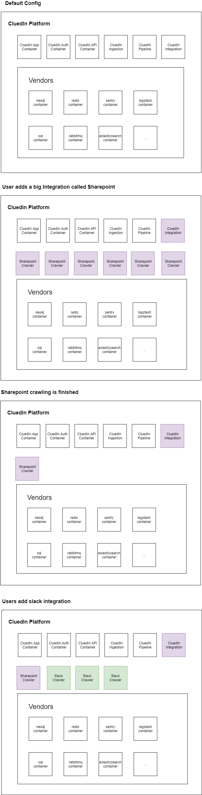

# Internal Documentation

## CluedIn CI/CD

### Feature Branching

TODO

## Micro Services

### Why moving towards a micro-service approach?

The reason to move towards micro-service is not because it's a buzz word in the software engeneering world but because it does bring value for a platform like CluedIn.

In order to leverage Kubernetes ability to auto-scale, the whole platform needs to be able to scale organicaly.

Here the term organicaly means 'just in time'.

By default, CluedIn would run each container as a single node.

Kubernetes would check for some 'live readiness' metrics in order to know which container he needs to scale.

### The benefits

#### Let dedicated tool doing the scaling

By having micro-services in place, you let a tool dedicated to orchestratation to deal with the scability, it means you need less 'in-house' code to glue it all together, or 'custom code' to deploy and/or spin new box that would be needed. 

#### Cost saving

By decoupling the platform into multiple container, we give the opportunity to Kubernetes to orchestrate the auto-scaling instead of 'us'. The more services we have, the less accurate we can be to allocate computing time to the required services.

#### Scaling staff

When you have all in one container, it makes it hard for the developers to move quickly as each time, they need to 'bring the whole world' with them (build/test/deployment). By having a clear cut between responsbility in the platform, it helps a developer to focus on one specific aspect.

It also increases paralellism as people can work indepently in different aspects of the platform without the fear to 'break' other on-going development.

It is, after, the duty of the CI/CD environment to catch for incompatiblity.

#### Learning Curve

When you have multiple well defined micro-service that are documented, it makes the learing curve for a new team member much more effective as he acts on a sub-set of the platform that he can swallow step by step. It means, team member can quickly bring values for the product team without the need to know the whole solution.

#### Increase robustness

When you have multiple services, you decrease your chance of 'breaking' unexpected part of the platform. As a micro-service has a clear 'scope', the developer knows where could be the pain point.

### Leverage auto-scaling in CluedIn

Naive example of how leveraging micro-service could help us on crawling.

Of course, this could also be used for 'merging engine', 'computing KPIs'....